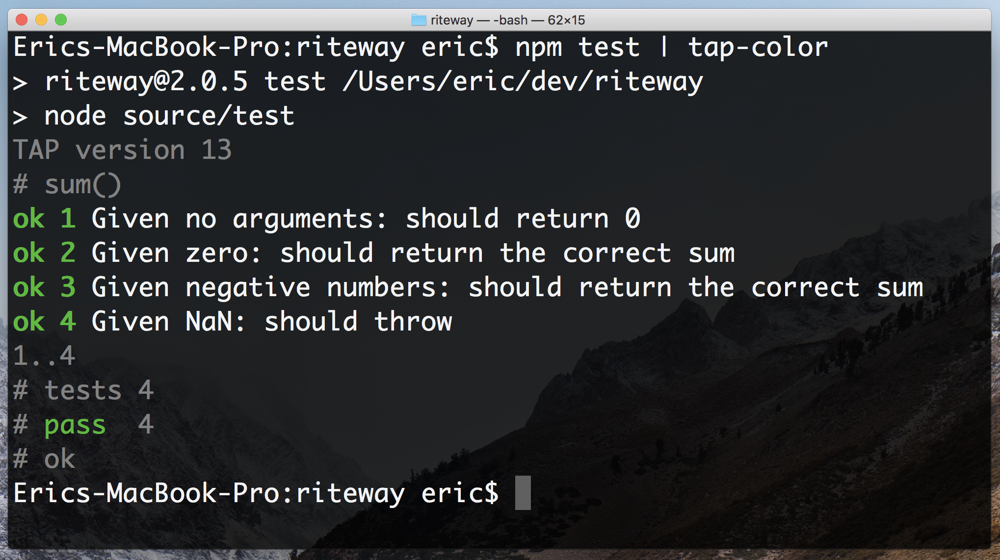

# Riteway

Simple, readable, helpful unit tests.

* **R**eadable
* **I**solated/**I**ntegrated
* **T**horough
* **E**xplicit

Riteway forces you to write **R**eadable, **I**solated, and **E**xplicit tests, because that's the only way you can use the API. It also makes it easier to be thorough by making test assertions so simple that you'll want to write more of them.

There are [5 questions every unit test must answer](https://medium.com/javascript-scene/what-every-unit-test-needs-f6cd34d9836d). Riteway forces you to answer them.

1. What is the unit under test (module, function, class, whatever)?
2. What should it do? (Prose description)
3. What was the actual output?
4. What was the expected output?
5. How do you reproduce the failure?


## Installing

```shell
npm install --save-dev riteway
```

Then add an npm command in your package.json:

```json
"test": "riteway test/**/*-test.js",
```

Now you can run your tests with `npm test`. Riteway also supports full TAPE-compatible usage syntax, so you can have an advanced entry that looks like:

```json
"test": "nyc riteway test/**/*-rt.js | tap-nirvana",
```

In this case, we're using [nyc](https://www.npmjs.com/package/nyc), which generates test coverage reports. The output is piped through an advanced TAP formatter, [tap-nirvana](https://www.npmjs.com/package/tap-nirvana) that adds color coding, source line identification and advanced diff capabilities.

### Troubleshooting

If you get an error like:

```shell
SyntaxError: Unexpected identifier
    at new Script (vm.js:79:7)
    at createScript (vm.js:251:10)
    at Object.runInThisContext (vm.js:303:10)
...
```

The problem is likely that you need a `.babelrc` configured with support for esm (standard JavaScript modules) and/or React. If you need React support, that might look something like:

```json
{
  "presets": [
    [
      "@babel/preset-env",
      {
        "targets": [
          "last 2 versions",
          "safari >= 7"
        ]
      }
    ],
    "@babel/preset-react"
  ],
  "plugins": [
    [
      "@babel/plugin-transform-runtime",
      { "corejs": 2 }
    ]
  ]
}
```

To install babel devDependencies:

```shell
npm install --save-dev @babel/core @babel/plugin-transform-runtime @babel/preset-env @babel/register @babel/runtime-corejs2
```

And if you're using react:

```shell
npm install --save-dev @babel/preset-react
```

You can then update your test script in `package.json` to use babel:

```json
"test": "node -r @babel/register source/test"
```

If you structure your folders by type like this:

```shell
├──todos
│  ├── component
│  ├── reducer
│  └── test
└──user
   ├── component
   ├── reducer
   └── test
```

Update your test script to find all files with your custom ending:

```json
"test": "riteway -r @babel/register 'src/**/*.test.js' | tap-nirvana",
```

### Usage with ESM Modules

If you want to use ESM modules instead of compiling, you'll need to import from the esm folder:

```js
import { describe } from 'riteway/esm/riteway.js';
import { match } from 'riteway/esm/match.js';

// Note: If you're using a compiler for JSX, you might want to handle
// ESM modules with it, too, so you shouldn't need the ESM modules, but
// if you want to use them anyway:
import { render } from 'riteway/esm/render.js';
```

The script to run your tests should be run using `node` instead of `riteway`, like this:

```json
"test": "node test/index-test.js",
```

Since the tests are being run using `node`, it will not be possible to use globs to select the test files. You're encouraged to create a single entry test file which imports all test files from your project.

### Usage with SWC

SWC is a fast, Rust based compiler that is [the new default compiler in Next.js 12+](https://nextjs.org/blog/next-12#faster-builds-and-fast-refresh-with-rust-compiler).

If you'd like to use it, there are some additional configuration steps:

1. Configure SWC to recognize React and JSX.
2. Configure your project to use [absolute import paths](https://nextjs.org/docs/advanced-features/module-path-aliases).
3. Configure SWC to recognize `.module.css` files or `.css` files in your Next.js project.
4. Configure SWC to run `styled-jsx` plugins, if you use it.

Here is how you can compile your code with SWC and run Riteway tests.

Install [`@swc/core`](https://swc.rs/docs/getting-started) and [`@swc/register`](https://github.com/swc-project/register):

```
npm install --save-dev @swc/core @swc/register
```

or

```
yarn add --dev @swc/core @swc/register
```

Add a `"test"` script to your `package.json`:

```json
"test": "node -r @swc/register src/test.js",
```

Create an `.swcrc` file with the options you need. Hint: Try the [SWC Playground](https://swc.rs/playground) for help generating valid SWC configurations. Example with css modules, absolute path, and React support:

```json
{
  "jsc": {
    "baseUrl": "./src",
    "paths": {
      "*.css": ["utils/identity-object-proxy.js"],
      "utils/*": ["utils/*"]
    },
    "parser": {
      "jsx": true,
      "syntax": "ecmascript"
    },
    "transform": {
      "react": {
        "runtime": "automatic"
      }
    },
    "experimental": {
      "plugins": [
        ["@swc/plugin-styled-jsx", {}]
      ]
    }
  },
  "module": {
    "type": "commonjs"
  }
}
```

The `"baseUrl"` setting combined with `"utils/*": ["utils/*"]` is an example if you're using an absolute import from `src/utils`, e.g. `utils/pipe`. You'll need to add this for every folder for which you're using absolute imports.

The `"parser"` and `"transform"` settings tell SWC how to handle JSX and [files that use React without importing it](https://reactjs.org/blog/2020/09/22/introducing-the-new-jsx-transform.html).

The `"module"` settings allows you to use modern syntax like `import`.

`"*.css": ["utils/identity-object-proxy.js"],` tells SWC to replace all absolute CSS imports with an identity object proxy. (**Note:** relative imports like `import './styles.css` will NOT be replaced, and you need to convert them to absolute imports.) An identity object proxy is an object that returns each key stringified when accessed. For example `obj.foo` returns `"foo"`.

You will need to create the identity object proxy yourself. Here is an example:

```js
const identityObjectProxy = new Proxy(
  {},
  {
    get: function getter(target, key) {
      if (key === '__esModule') {
        return false;
      }

      return key;
    },
  },
);

export default identityObjectProxy;
```


## Example Usage

```js
import { describe, Try } from 'riteway';

// a function to test
const sum = (...args) => {
  if (args.some(v => Number.isNaN(v))) throw new TypeError('NaN');
  return args.reduce((acc, n) => acc + n, 0);
};

describe('sum()', async assert => {
  const should = 'return the correct sum';

  assert({
    given: 'no arguments',
    should: 'return 0',
    actual: sum(),
    expected: 0
  });

  assert({
    given: 'zero',
    should,
    actual: sum(2, 0),
    expected: 2
  });

  assert({
    given: 'negative numbers',
    should,
    actual: sum(1, -4),
    expected: -3
  });

  assert({
    given: 'NaN',
    should: 'throw',
    actual: Try(sum, 1, NaN).toString(),
    expected: 'TypeError: NaN'
  });  
});
```

### Testing React Components

```js
import React from 'react';
import render from 'riteway/render-component';
import { describe } from 'riteway';

describe('renderComponent', async assert => {
  const $ = render(<div className="foo">testing</div>);

  assert({
    given: 'some jsx',
    should: 'render markup',
    actual: $('.foo').html().trim(),
    expected: 'testing'
  });
});
```

Riteway makes it easier than ever to test pure React components using the `riteway/render-component` module. A pure component is a component which, given the same inputs, always renders the same output.

I don't recommend unit testing stateful components, or components with side-effects. Write functional tests for those, instead, because you'll need tests which describe the complete end-to-end flow, from user input, to back-end-services, and back to the UI. Those tests frequently duplicate any testing effort you would spend unit-testing stateful UI behaviors. You'd need to do a lot of mocking to properly unit test those kinds of components anyway, and that mocking may cover up problems with too much coupling in your component. See ["Mocking is a Code Smell"](https://medium.com/javascript-scene/mocking-is-a-code-smell-944a70c90a6a) for details.

A great alternative is to encapsulate side-effects and state management in container components, and then pass state into pure components as props. Unit test the pure components and use functional tests to ensure that the complete UX flow works in real browsers from the user's perspective.

#### Isolating React Unit Tests

When you [unit test React components](https://medium.com/javascript-scene/unit-testing-react-components-aeda9a44aae2) you frequently have to render your components many times. Often, you want different props for some tests.

Riteway makes it easy to isolate your tests while keeping them readable by using [factory functions](https://link.medium.com/WxHPhCc3OV) in conjunction with [block scope](https://developer.mozilla.org/en-US/docs/Web/JavaScript/Reference/Statements/block).

```js
import ClickCounter from '../click-counter/click-counter-component';

describe('ClickCounter component', async assert => {
  const createCounter = clickCount =>
    render(<ClickCounter clicks={ clickCount } />)
  ;

  {
    const count = 3;
    const $ = createCounter(count);
    assert({
      given: 'a click count',
      should: 'render the correct number of clicks.',
      actual: parseInt($('.clicks-count').html().trim(), 10),
      expected: count
    });
  }

  {
    const count = 5;
    const $ = createCounter(count);
    assert({
      given: 'a click count',
      should: 'render the correct number of clicks.',
      actual: parseInt($('.clicks-count').html().trim(), 10),
      expected: count
    });
  }
});
```

## Output

Riteway produces standard TAP output, so it's easy to integrate with just about any test formatter and reporting tool. (TAP is a well established standard with hundreds (thousands?) of integrations).

```shell
TAP version 13
# sum()
ok 1 Given no arguments: should return 0
ok 2 Given zero: should return the correct sum
ok 3 Given negative numbers: should return the correct sum
ok 4 Given NaN: should throw

1..4
# tests 4
# pass  4

# ok
```

Prefer colorful output? No problem. The standard TAP output has you covered. You can run it through any TAP formatter you like:

```shell
npm install -g tap-color
npm test | tap-color
```




## API

### describe

```js
describe = (unit: String, cb: TestFunction) => Void
```

Describe takes a prose description of the unit under test (function, module, whatever), and a callback function (`cb: TestFunction`). The callback function should be an [async function](https://developer.mozilla.org/en-US/docs/Web/JavaScript/Reference/Statements/async_function) so that the test can automatically complete when it reaches the end. Riteway assumes that all tests are asynchronous. Async functions automatically return a promise in JavaScript, so Riteway knows when to end each test.

### describe.only

```js
describe.only = (unit: String, cb: TestFunction) => Void
```

Like Describe, but don't run any other tests in the test suite.  See [test.only](https://github.com/substack/tape#testonlyname-cb)

### describe.skip

```js
describe.skip = (unit: String, cb: TestFunction) => Void
```

Skip running this test. See [test.skip](https://github.com/substack/tape#testskipname-cb)

### TestFunction

```js
TestFunction = assert => Promise<void>
```

The `TestFunction` is a user-defined function which takes `assert()` and must return a promise. If you supply an async function, it will return a promise automatically. If you don't, you'll need to explicitly return a promise.

Failure to resolve the `TestFunction` promise will cause an error telling you that your test exited without ending. Usually, the fix is to add `async` to your `TestFunction` signature, e.g.:

```js
describe('sum()', async assert => {
  /* test goes here */
});
```


### assert

```js
assert = ({
  given = Any,
  should = '',
  actual: Any,
  expected: Any
} = {}) => Void, throws
```

The `assert` function is the function you call to make your assertions. It takes prose descriptions for `given` and `should` (which should be strings), and invokes the test harness to evaluate the pass/fail status of the test. Unless you're using a custom test harness, assertion failures will cause a test failure report and an error exit status.

Note that `assert` uses [a deep equality check](https://github.com/substack/node-deep-equal) to compare the actual and expected values. Rarely, you may need another kind of check. In those cases, pass a JavaScript expression for the `actual` value.

### createStream

```js
createStream = ({ objectMode: Boolean }) => NodeStream
```

Create a stream of output, bypassing the default output stream that writes messages to `console.log()`. By default the stream will be a text stream of TAP output, but you can get an object stream instead by setting `opts.objectMode` to `true`.

```js
import { describe, createStream } from 'riteway';

createStream({ objectMode: true }).on('data', function (row) {
    console.log(JSON.stringify(row))
});

describe('foo', async assert => {
  /* your tests here */
});
```

### countKeys

Given an object, return a count of the object's own properties.

```js
countKeys = (Object) => Number
```

This function can be handy when you're adding new state to an object keyed by ID, and you want to ensure that the correct number of keys were added to the object.


## Render Component

First, import `render` from `riteway/render-component`:

```js
import render from 'riteway/render-component';
```

```js
render = (jsx) => CheerioObject
```

Take a JSX object and return a [Cheerio object](https://cheerio.js.org/), a partial implementation of the jQuery core API which makes selecting from your rendered JSX markup just like selecting with jQuery or the `querySelectorAll` API.

### Example

```js
describe('MyComponent', async assert => {
  const $ = render(<MyComponent />);

  assert({
    given: 'no params',
    should: 'render something with the my-component class',
    actual: $('.my-component').length,
    expected: 1
  });
});
```


## Match

First, import `match` from `riteway/match`:

```js
import match from 'riteway/match';
```

```js
match = text => pattern => String
```

Take some text to search and return a function which takes a pattern and returns the matched text, if found, or an empty string. The pattern can be a string or regular expression.

### Example

Imagine you have a React component you need to test. The component takes some text and renders it in some div contents. You need to make sure that the passed text is getting rendered.

```js
const MyComponent = ({text}) => <div className="contents">{text}</div>;
```

You can use match to create a new function that will test to see if your search
text contains anything matching the pattern you passed in. Writing tests this way
allows you to see clear expected and actual values, so you can expect the specific
text you're expecting to find:

```js
describe('MyComponent', async assert => {
  const text = 'Test for whatever you like!';
  const $ = render(<MyComponent text={ text }/>);
  const contains = match($('.contents').html());

  assert({
    given: 'some text to display',
    should: 'render the text.',
    actual: contains(text),
    expected: text
  });
});
```

## Vitest

[Vitest](https://vitest.dev/guide/) is a [Vite](https://vitejs.dev/) plugin through which you can run Riteway tests. It's a great way to get started with Riteway, because it's easy to set up and it's fast.

### Installing

First you will need to install Vitest. You will also need to install Riteway into your project if you have not already done so. You can use any package manager you like:

```shell
pnpm add --save-dev vitest
npm install --save-dev vitest
yarn add --save-dev vitest
```

### Usage

First, import `assert` from `riteway/vitest` and `describe` from `vitest`:

```ts
import { assert } from 'riteway/vitest';
import { describe } from "vitest";
```

Then, as simple as that, you should be able to use the Vitest runner to test. You can trigger the Vitest directly or add a script to your package.json. Running `npm vitest` would do the trick to see a basic test setup. See [here](https://vitest.dev/config/) for additional details on setting up a Vitest configuration.


```ts
// a function to test
const sum = (...args) => {
  if (args.some(v => Number.isNaN(v))) throw new TypeError('NaN');
  return args.reduce((acc, n) => acc + n, 0);
};

describe('sum()', () => {
  const should = 'return the correct sum';

  assert({
    given: 'no arguments',
    should: 'return 0',
    actual: sum(),
    expected: 0
  });

  assert({
    given: 'two numbers',
    should: 'return the correct sum',
    actual: sum(2, 0),
    expected: 2
  });
});
```