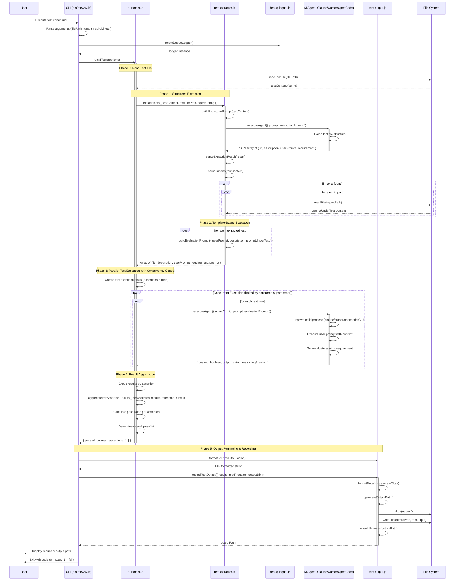

# AI Testing Framework - Sequence Diagram

This sequence diagram shows the complete flow of the AI testing framework from test file input to TAP output.

## Key Phases

1. **Phase 0: File Reading** - Read test file content from disk
2. **Phase 1: Structured Extraction** - AI agent extracts test metadata
3. **Phase 2: Template-Based Evaluation** - Transform metadata into controlled evaluation prompts
4. **Phase 3: Parallel Execution** - Run tests concurrently with controlled concurrency
5. **Phase 4: Result Aggregation** - Calculate pass rates and determine overall status
6. **Phase 5: Output Generation** - Format as TAP and write to file

## Critical Design Patterns

### Two-Phase Extraction Architecture
The framework uses a two-phase approach instead of asking the AI to create "self-evaluating prompts":

- **Phase 1 (Extraction)**: AI parses test file → structured metadata
- **Phase 2 (Template)**: Code transforms metadata → controlled evaluation prompts

This ensures reliable `{passed: boolean}` responses that can be aggregated correctly.

### Concurrency Control
Tests execute in parallel with a configurable concurrency limit to prevent resource exhaustion while maximizing throughput.

### Import Resolution
The framework supports importing context files (promptUnderTest) that are injected into evaluation prompts, enabling testing of AI behaviors with specific system prompts or instructions.
