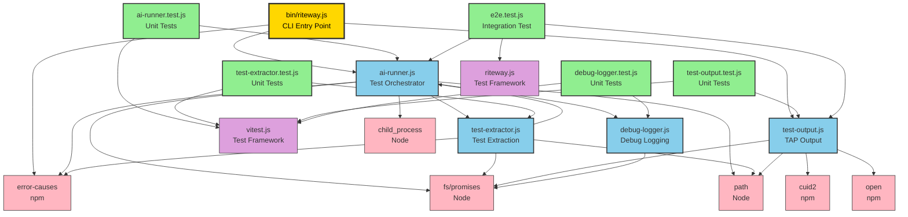
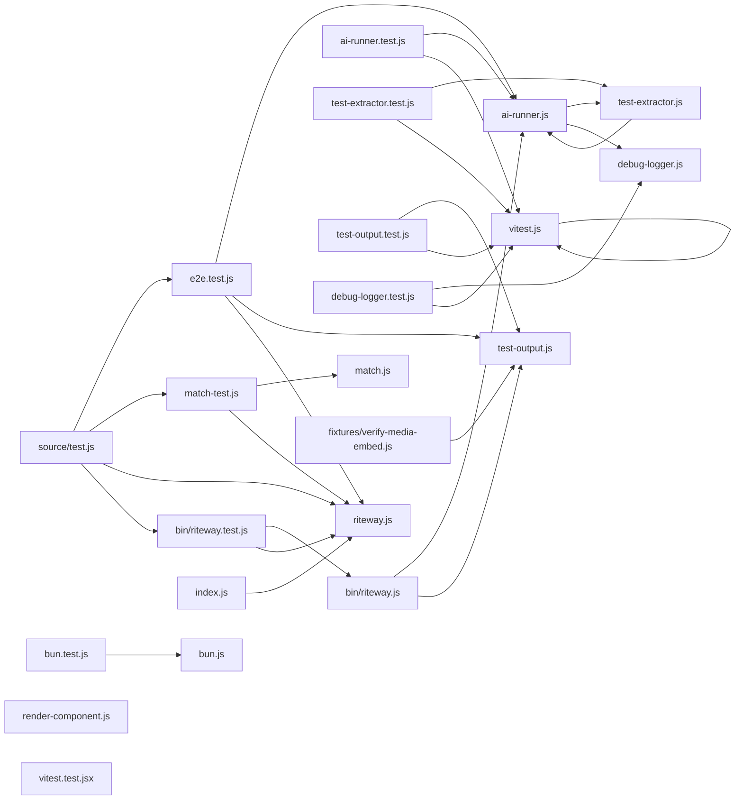

# AI Testing Framework - Dependency Diagram

This dependency diagram shows the module relationships within the Riteway AI testing framework.

## AI Testing Framework Core Modules



## Circular Dependency Analysis

### Runner ⟷ Extractor Circular Dependency

**Identified:**
- `ai-runner.js` imports from `test-extractor.js`
- `test-extractor.js` imports from `ai-runner.js`

**Dependencies:**

```javascript
// ai-runner.js imports:
import { extractTests } from './test-extractor.js';

// test-extractor.js imports:
import { executeAgent, validateFilePath } from './ai-runner.js';
```

**Analysis:**

This is a **valid functional circular dependency**, not a problematic architectural issue:

1. **Separation of Concerns**:
   - `ai-runner.js`: Agent execution & test orchestration
   - `test-extractor.js`: Test parsing & prompt building

2. **Used Functions**:
   - `ai-runner.js` uses `extractTests()` for Phase 1 (extraction)
   - `test-extractor.js` uses `executeAgent()` for calling the extraction agent
   - `test-extractor.js` uses `validateFilePath()` for security validation

3. **No Initialization Deadlock**:
   - All exports are function declarations (hoisted)
   - No module-level side effects
   - JavaScript module system handles this gracefully

4. **Architectural Rationale**:
   - `executeAgent()` is a generic utility for spawning agent subprocesses
   - `extractTests()` is a specialized extractor that needs the generic agent executor
   - `validateFilePath()` is a security utility shared across modules
   - Refactoring would require creating a third "utilities" module, adding unnecessary complexity

**Verdict:** ✅ **Acceptable** - Functional circular dependency with clear separation of concerns.

**Alternative Refactor** (if needed):
```
utils/
  agent-executor.js  → executeAgent()
  path-validator.js  → validateFilePath()
ai-runner.js         → runAITests, aggregation
test-extractor.js    → extractTests, prompt building
```

Trade-off: Adds file complexity for marginal architectural purity gain.

---

## Module Responsibility Matrix

| Module | Primary Responsibility | Exports | Internal Dependencies | External Dependencies |
|--------|----------------------|---------|----------------------|----------------------|
| **bin/riteway.js** | CLI entry point, argument parsing, command routing | None (executable) | ai-runner, test-output | minimist, error-causes |
| **ai-runner.js** | Test orchestration, agent execution, result aggregation | executeAgent, runAITests, validateFilePath, parseStringResult, parseOpenCodeNDJSON, calculateRequiredPasses, aggregatePerAssertionResults, verifyAgentAuthentication, readTestFile | test-extractor, debug-logger | fs/promises, child_process, path, error-causes |
| **test-extractor.js** | Test extraction, import resolution, evaluation prompt building | extractTests, buildExtractionPrompt, buildEvaluationPrompt, parseExtractionResult, parseImports | ai-runner (executeAgent, validateFilePath) | fs/promises, path, error-causes |
| **test-output.js** | TAP formatting, file output, browser launching | recordTestOutput, formatTAP, generateOutputPath, formatDate, generateSlug, openInBrowser, generateLogFilePath | None | fs/promises, path, open, @paralleldrive/cuid2 |
| **debug-logger.js** | Debug logging to console and file | createDebugLogger | None | fs (appendFileSync) |

---

## Dependency Depth Analysis

### Level 0: No Internal Dependencies
- `debug-logger.js` (pure utility)

### Level 1: Direct Dependencies Only
- `test-output.js` → external packages only

### Level 2: One Layer of Internal Dependencies
- `ai-runner.js` → test-extractor, debug-logger
- `test-extractor.js` → ai-runner (circular)

### Level 3: CLI Orchestration
- `bin/riteway.js` → ai-runner, test-output

**Depth Verdict:** ✅ **Shallow** - Maximum depth of 3 levels, good for maintainability.

---

## External Dependency Analysis

### Production Dependencies Used by AI Framework

| Package | Purpose | Used By | Risk Level |
|---------|---------|---------|-----------|
| **@paralleldrive/cuid2** | Unique slug generation | test-output.js | Low (internal package) |
| **error-causes** | Structured error handling | ai-runner.js, test-extractor.js, bin/riteway.js | Low (internal package) |
| **open** | Browser launching | test-output.js | Low (optional feature) |
| **glob** | Not used by AI framework | - | N/A |
| **minimist** | CLI argument parsing | bin/riteway.js | Low (standard) |
| **resolve** | Not used by AI framework | - | N/A |
| **cheerio** | Not used by AI framework | - | N/A |
| **dotignore** | Not used by AI framework | - | N/A |

### Node.js Built-in Dependencies

| Module | Purpose | Used By | Stability |
|--------|---------|---------|-----------|
| **fs/promises** | File I/O | ai-runner.js, test-extractor.js, test-output.js | Stable |
| **fs (sync)** | Sync file append | debug-logger.js | Stable |
| **child_process** | Subprocess spawning | ai-runner.js | Stable |
| **path** | Path manipulation | ai-runner.js, test-extractor.js, test-output.js | Stable |

**Dependency Verdict:** ✅ **Minimal** - Small attack surface, mostly internal packages and Node.js built-ins.

---

## Full Project Dependency Graph



---

## Architecture Metrics

### Complexity Metrics

| Metric | Value | Assessment |
|--------|-------|------------|
| **Total Modules** | 4 core modules | ✅ Small, focused |
| **Circular Dependencies** | 1 (runner ⟷ extractor) | ✅ Acceptable, functional |
| **Max Dependency Depth** | 3 levels | ✅ Shallow |
| **External Dependencies** | 3 production (cuid2, error-causes, open) | ✅ Minimal |
| **Module Cohesion** | High (single responsibility per module) | ✅ Good |
| **Module Coupling** | Low-moderate (functional dependencies) | ✅ Acceptable |

### Maintainability Score: **A** (Excellent)

Rationale:
- Clear separation of concerns
- Shallow dependency tree
- Minimal external dependencies
- Well-tested (185 tests)
- No problematic circular dependencies
- Pure functional patterns

---

## Refactoring Opportunities

### 1. Extract Agent Utilities (Optional)

**Current:** `ai-runner.js` contains both orchestration and agent execution utilities

**Refactor:**
```
source/
  ai-runner.js          → runAITests, aggregation (orchestration)
  agent-executor.js     → executeAgent, parseStringResult, parseOpenCodeNDJSON
  path-validator.js     → validateFilePath
  test-extractor.js     → extractTests (now depends on agent-executor)
```

**Benefit:** Breaks circular dependency, clearer separation

**Cost:** More files, import complexity

**Recommendation:** ⚠️ **Not recommended** - Current structure is clear and functional

### 2. Consolidate Response Parsing (Low Priority)

**Current:** Multiple parsing functions in `ai-runner.js`:
- `parseStringResult()`
- `parseOpenCodeNDJSON()`

**Refactor:** Create `response-parser.js` with strategy pattern

**Benefit:** Easier to add new agent formats

**Cost:** Over-engineering for 2 parsers

**Recommendation:** ⚠️ **Wait** - Add when 3rd parser needed

---

## Conclusion

The AI testing framework has a **clean, maintainable architecture** with:
- ✅ Clear separation of concerns
- ✅ Shallow dependency tree
- ✅ Minimal external dependencies
- ✅ One acceptable circular dependency (functional, not architectural)
- ✅ High test coverage

**No immediate refactoring needed.** Current structure is production-ready.
