# AI Testing Framework - Architecture Flowchart

This flowchart illustrates the high-level architecture and decision flow of the AI testing framework.

```mermaid
flowchart TD
    Start([User executes test]) --> ParseArgs[Parse CLI Arguments]
    ParseArgs --> ValidatePath{Valid file path?}

    ValidatePath -->|No| ErrorPath[Throw SecurityError]
    ValidatePath -->|Yes| CheckAuth{Verify agent authentication}

    CheckAuth -->|Failed| AuthError[Display authentication error & exit]
    CheckAuth -->|Success| ReadFile[Read test file content]

    ReadFile --> ExtractPhase1[Phase 1: Structured Extraction]

    ExtractPhase1 --> BuildExtractPrompt[Build extraction prompt]
    BuildExtractPrompt --> ExecuteExtract[Execute extraction agent]
    ExecuteExtract --> ParseExtract[Parse NDJSON/JSON output]
    ParseExtract --> ValidateExtract{Valid JSON array?}

    ValidateExtract -->|No| ParseError[Throw ParseError]
    ValidateExtract -->|Yes| CheckFields{All required fields present?}

    CheckFields -->|No| ValidationError[Throw ValidationError]
    CheckFields -->|Yes| CheckImports{Imports detected?}

    CheckImports -->|Yes| ResolveImports[Resolve import paths]
    ResolveImports --> ValidateImportPaths{Paths valid?}
    ValidateImportPaths -->|No| PathTraversalError[Throw SecurityError]
    ValidateImportPaths -->|Yes| ReadImports[Read imported files]
    ReadImports --> BuildContext[Build promptUnderTest context]

    CheckImports -->|No| BuildContext
    BuildContext --> ExtractPhase2[Phase 2: Template-Based Evaluation]

    ExtractPhase2 --> TransformLoop[Transform each extracted test]
    TransformLoop --> BuildEvalPrompt[buildEvaluationPrompt with template]
    BuildEvalPrompt --> InjectContext{Has promptUnderTest?}

    InjectContext -->|Yes| AddContext[Inject context into prompt]
    InjectContext -->|No| NoContext[Use prompt without context]

    AddContext --> CreateTasks[Create test execution tasks]
    NoContext --> CreateTasks

    CreateTasks --> CalcRequired[Calculate required passes from threshold]
    CalcRequired --> InitConcurrency[Initialize concurrency limiter]

    InitConcurrency --> ParallelExec[Execute tests in parallel]

    ParallelExec --> ExecLoop{More tasks?}
    ExecLoop -->|Yes| CheckLimit{At concurrency limit?}

    CheckLimit -->|Yes| WaitForSlot[Wait for available slot]
    WaitForSlot --> SpawnAgent[Spawn agent subprocess]

    CheckLimit -->|No| SpawnAgent
    SpawnAgent --> SendPrompt[Send evaluation prompt via stdin]
    SendPrompt --> WaitResponse[Wait for agent response]
    WaitResponse --> Timeout{Timeout?}

    Timeout -->|Yes| KillProc[Kill process]
    KillProc --> TimeoutError[Throw timeout error]

    Timeout -->|No| CheckExitCode{Exit code = 0?}
    CheckExitCode -->|No| ProcError[Throw process error]
    CheckExitCode -->|Yes| ParseOutput[Parse agent output]

    ParseOutput --> TryJSON{Valid JSON?}
    TryJSON -->|No| TryMarkdown[Try extract from markdown]
    TryMarkdown --> StillNotJSON{Valid JSON?}
    StillNotJSON -->|No| JSONError[Throw ParseError]

    TryJSON -->|Yes| CheckEnvelope{Has result field?}
    StillNotJSON -->|Yes| CheckEnvelope

    CheckEnvelope -->|Yes| UnwrapResult[Extract result field]
    CheckEnvelope -->|No| UseAsIs[Use parsed object]

    UnwrapResult --> ValidateSchema{Has passed field?}
    UseAsIs --> ValidateSchema

    ValidateSchema -->|No| SchemaError[Throw validation error]
    ValidateSchema -->|Yes| StoreResult[Store test result]

    StoreResult --> ExecLoop

    ExecLoop -->|No| GroupResults[Group results by assertion]
    GroupResults --> AggregateLoop[For each assertion]

    AggregateLoop --> CountPasses[Count passing runs]
    CountPasses --> CheckThreshold{Passes >= required?}

    CheckThreshold -->|Yes| MarkPass[Mark assertion as passed]
    CheckThreshold -->|No| MarkFail[Mark assertion as failed]

    MarkPass --> NextAssertion{More assertions?}
    MarkFail --> NextAssertion

    NextAssertion -->|Yes| AggregateLoop
    NextAssertion -->|No| CheckOverall{All assertions passed?}

    CheckOverall -->|Yes| OverallPass[Set overall passed = true]
    CheckOverall -->|No| OverallFail[Set overall passed = false]

    OverallPass --> FormatTAP[Format results as TAP]
    OverallFail --> FormatTAP

    FormatTAP --> GeneratePath[Generate output path with date + slug]
    GeneratePath --> CreateDir[Create output directory]
    CreateDir --> WriteFile[Write TAP to file]
    WriteFile --> OpenBrowser{openBrowser flag?}

    OpenBrowser -->|Yes| TryOpen[Try open in browser]
    TryOpen --> BrowserResult{Success?}
    BrowserResult -->|No| WarnUser[Log warning]

    OpenBrowser -->|No| DisplayPath[Display output path]
    BrowserResult -->|Yes| DisplayPath
    WarnUser --> DisplayPath

    DisplayPath --> FlushLogs[Flush debug logs]
    FlushLogs --> ExitCode{Overall passed?}

    ExitCode -->|Yes| Exit0([Exit with code 0])
    ExitCode -->|No| Exit1([Exit with code 1])

    ErrorPath --> ExitErr([Exit with error])
    AuthError --> ExitErr
    ParseError --> ExitErr
    ValidationError --> ExitErr
    PathTraversalError --> ExitErr
    TimeoutError --> ExitErr
    ProcError --> ExitErr
    JSONError --> ExitErr
    SchemaError --> ExitErr

    style Start fill:#90EE90
    style Exit0 fill:#90EE90
    style Exit1 fill:#FFB6C1
    style ExitErr fill:#FF6B6B
    style ExtractPhase1 fill:#87CEEB
    style ExtractPhase2 fill:#87CEEB
    style ParallelExec fill:#DDA0DD
    style FormatTAP fill:#F0E68C
```

## Architecture Layers

### 1. Input Validation Layer
- CLI argument parsing
- File path validation (prevent path traversal)
- Agent authentication verification

### 2. Extraction Layer (Two-Phase)
**Phase 1: Structured Extraction**
- AI agent parses test file
- Returns structured metadata
- Validates extraction result

**Phase 2: Template-Based Evaluation**
- Code transforms metadata into evaluation prompts
- Controlled template ensures reliable response format
- Injects imported context if present

### 3. Execution Layer
- Parallel test execution with concurrency control
- Per-assertion isolation (each runs independently)
- Multiple runs per assertion (default: 4)
- Timeout handling for hung processes
- JSON response parsing with fallback strategies

### 4. Aggregation Layer
- Groups results by assertion
- Calculates pass rate per assertion
- Applies threshold (default: 75%)
- Determines overall pass/fail status

### 5. Output Layer
- TAP (Test Anything Protocol) formatting
- Timestamped output files with unique slugs
- Optional browser preview
- Debug log file generation

## Key Decision Points

### Path Validation
Prevents directory traversal attacks by validating all file paths against base directory.

### Import Resolution
Imports are resolved relative to project root (cwd) for portability. Path traversal validation prevents security issues.

### Concurrency Control
Limits parallel execution to prevent resource exhaustion. Default: 4 concurrent tests.

### Threshold Evaluation
Uses ceiling function to calculate required passes: `Math.ceil(runs × threshold / 100)`

This ensures threshold is met or exceeded, not undercut by rounding.

### JSON Parsing Strategies
Multiple fallback strategies handle different agent output formats:
1. Direct JSON parse
2. Extract from markdown code fences
3. Unwrap result envelope (Claude CLI format)
4. Re-parse nested string results

### Agent Output Handling
Different agents return different formats:
- **Claude CLI**: Wrapped in `{result: ...}` envelope
- **OpenCode**: NDJSON (newline-delimited JSON) with text events
- **Cursor**: Direct JSON (assumed - needs verification)

The framework handles all formats transparently via `parseOutput` functions.
