# AI Testing Framework - Two-Agent Architecture Flowchart

This flowchart illustrates the high-level architecture and decision flow of the AI testing framework using the two-agent pattern (result agent + judge agent).

```mermaid
flowchart TD
    Start([User executes test]) --> ParseArgs[Parse CLI Arguments]
    ParseArgs --> ValidatePath{Valid file path?}

    ValidatePath -->|No| ErrorPath[Throw SecurityError]
    ValidatePath -->|Yes| CheckAuth{Verify agent authentication}

    CheckAuth -->|Failed| AuthError[Display authentication error & exit]
    CheckAuth -->|Success| ReadFile[Read test file content]

    ReadFile --> Extraction[Extraction: Agent-Directed Analysis]

    Extraction --> BuildExtractPrompt[Build extraction prompt]
    BuildExtractPrompt --> ExecuteExtract[Execute extraction agent]
    ExecuteExtract --> ParseExtract[Parse NDJSON/JSON output]
    ParseExtract --> ValidateExtract{Valid extraction result?}

    ValidateExtract -->|No| ParseError[Throw ParseError]
    ValidateExtract -->|Yes| CheckFields{All required fields present?<br>userPrompt, assertions, importPaths}

    CheckFields -->|No| ValidationError[Throw ValidationError]
    CheckFields -->|Yes| CheckImports{Agent identified<br>importPaths?}

    CheckImports -->|Yes| ResolveImports[Resolve import paths relative to project root]
    ResolveImports --> ValidateImportPaths{Paths valid?}
    ValidateImportPaths -->|No| PathTraversalError[Throw SecurityError]
    ValidateImportPaths -->|Yes| ReadImports[Read imported files]
    ReadImports --> ReadResult{Read succeeded?}
    ReadResult -->|No| PromptReadFailed[Throw PROMPT_READ_FAILED<br>with original error as cause]
    ReadResult -->|Yes| BuildContext[Build promptUnderTest context]

    CheckImports -->|No| ValidatePrompt{promptUnderTest present?}
    ValidatePrompt -->|No| MissingPrompt[Throw MISSING_PROMPT_UNDER_TEST]
    ValidatePrompt -->|Yes| BuildContext

    BuildContext --> ValidateUserPrompt{userPrompt non-empty?}
    ValidateUserPrompt -->|No| MissingUserPrompt[Throw MISSING_USER_PROMPT]
    ValidateUserPrompt -->|Yes| ValidateAssertions{assertions non-empty?}
    ValidateAssertions -->|No| NoAssertions[Throw NO_ASSERTIONS_FOUND]
    ValidateAssertions -->|Yes| ReturnStructured[Return structured data:<br>userPrompt, promptUnderTest, assertions]

    ReturnStructured --> BuildResultPrompt[buildResultPrompt<br>instructs plain text response]
    BuildResultPrompt --> CalcRequired[Calculate required passes from threshold]
    CalcRequired --> InitConcurrency[Initialize concurrency limiter]
    InitConcurrency --> RunExecution[Run Execution: Two-Agent Pattern]

    RunExecution --> RunLoop{More runs?}

    RunLoop -->|Yes| CheckLimit{At concurrency limit?}
    CheckLimit -->|Yes| WaitForSlot[Wait for available slot]
    WaitForSlot --> ResultAgent[Result Agent: Generate Only]
    CheckLimit -->|No| ResultAgent

    ResultAgent --> SpawnResult[Spawn agent subprocess]
    SpawnResult --> SendResultPrompt[Send result prompt via stdin]
    SendResultPrompt --> WaitResult[Wait for agent response]
    WaitResult --> ResultTimeout{Timeout?}

    ResultTimeout -->|Yes| KillResult[Kill process]
    KillResult --> TimeoutError[Throw TimeoutError]

    ResultTimeout -->|No| ResultExitCode{Exit code = 0?}
    ResultExitCode -->|No| ProcError[Throw AgentProcessError]
    ResultExitCode -->|Yes| UnwrapResult[Unwrap JSON envelope<br>rawOutput: true]
    UnwrapResult --> PlainText[Plain text result<br>entire stdout IS the result]

    PlainText --> JudgePhase[Judge Agents: Evaluate via Promise.all]

    JudgePhase --> JudgeLoop[For each assertion in parallel]
    JudgeLoop --> BuildJudge[buildJudgePrompt<br>result + ONE requirement + context]
    BuildJudge --> SpawnJudge[Spawn judge agent subprocess]
    SpawnJudge --> SendJudgePrompt[Send judge prompt via stdin]
    SendJudgePrompt --> WaitJudge[Wait for judge response]
    WaitJudge --> JudgeTimeout{Timeout?}

    JudgeTimeout -->|Yes| KillJudge[Kill process]
    KillJudge --> JudgeTimeoutErr[Throw TimeoutError]

    JudgeTimeout -->|No| JudgeExitCode{Exit code = 0?}
    JudgeExitCode -->|No| JudgeProcError[Throw AgentProcessError]
    JudgeExitCode -->|Yes| UnwrapJudge[Unwrap JSON envelope<br>rawOutput: true]
    UnwrapJudge --> ParseYAML[parseTAPYAML]
    ParseYAML --> ValidYAML{Valid TAP YAML block?}

    ValidYAML -->|No| YAMLError[Throw JUDGE_INVALID_TAP_YAML]
    ValidYAML -->|Yes| Normalize[normalizeJudgment]
    Normalize --> CheckObject{Response is object?}
    CheckObject -->|No| InvalidResponse[Throw JUDGE_INVALID_RESPONSE]
    CheckObject -->|Yes| ApplyDefaults[Apply safe defaults<br>log warnings for missing fields]
    ApplyDefaults --> StoreJudgment[Store judgment:<br>passed, actual, expected, score]

    StoreJudgment --> RunLoop

    RunLoop -->|No| GroupResults[Group results by assertion across all runs]
    GroupResults --> AggregateLoop[For each assertion]

    AggregateLoop --> CountPasses[Count passing runs]
    CountPasses --> CalcScore[Calculate averageScore]
    CalcScore --> CheckThreshold{Passes >= required?}

    CheckThreshold -->|Yes| MarkPass[Mark assertion as passed]
    CheckThreshold -->|No| MarkFail[Mark assertion as failed]

    MarkPass --> NextAssertion{More assertions?}
    MarkFail --> NextAssertion

    NextAssertion -->|Yes| AggregateLoop
    NextAssertion -->|No| CheckOverall{All assertions passed?}

    CheckOverall -->|Yes| OverallPass[Set overall passed = true]
    CheckOverall -->|No| OverallFail[Set overall passed = false]

    OverallPass --> FormatTAP[Format results as TAP<br>with score, actual, expected diagnostics]
    OverallFail --> FormatTAP

    FormatTAP --> GeneratePath[Generate output path with date + slug]
    GeneratePath --> CreateDir[Create output directory]
    CreateDir --> WriteFile[Write TAP to file]
    WriteFile --> DisplayPath[Display output path]
    DisplayPath --> FlushLogs[Flush debug logs]
    FlushLogs --> ExitCode{Overall passed?}

    ExitCode -->|Yes| Exit0([Exit with code 0])
    ExitCode -->|No| Exit1([Exit with code 1])

    ErrorPath --> ExitErr([Exit with error])
    AuthError --> ExitErr
    ParseError --> ExitErr
    ValidationError --> ExitErr
    PathTraversalError --> ExitErr
    PromptReadFailed --> ExitErr
    MissingPrompt --> ExitErr
    MissingUserPrompt --> ExitErr
    NoAssertions --> ExitErr
    TimeoutError --> ExitErr
    ProcError --> ExitErr
    JudgeTimeoutErr --> ExitErr
    JudgeProcError --> ExitErr
    YAMLError --> ExitErr
    InvalidResponse --> ExitErr

    style Start fill:#90EE90
    style Exit0 fill:#90EE90
    style Exit1 fill:#FFB6C1
    style ExitErr fill:#FF6B6B
    style Extraction fill:#87CEEB
    style RunExecution fill:#87CEEB
    style ResultAgent fill:#DDA0DD
    style JudgePhase fill:#F0E68C
    style FormatTAP fill:#F0E68C
```



## Architecture Layers

### 1. Input Validation Layer
- CLI argument parsing with Zod schema validation
- File path validation (prevent path traversal)
- Agent authentication verification

### 2. Extraction Layer (Agent-Directed)
- AI agent parses test file and identifies import paths declaratively
- No regex import parsing (parseImports removed)
- Returns structured metadata: userPrompt, importPaths, assertions
- Validates all required fields present and non-empty
- Import errors preserve original error as cause

### 3. Execution Layer (Two-Agent Pattern)

**Result Agent: Generate Only**
- Receives userPrompt + promptUnderTest
- Returns plain text (entire stdout IS the result)
- Called once per run (same result shared across all judges)
- rawOutput: true bypasses JSON parsing

**Judge Agent: Evaluate Only (parallel via Promise.all)**
- Receives result + ONE requirement + full context
- Returns TAP YAML diagnostic block
- Called once per assertion per run (all judges parallel within a run)
- parseTAPYAML extracts structured judgment
- normalizeJudgment applies safe defaults, logs warnings

**Concurrency Control**
- limitConcurrency applies ACROSS runs (prevents API exhaustion)
- Promise.all used WITHIN each run (judges are independent)

### 4. Aggregation Layer
- Groups results by assertion across all runs
- Calculates pass rate and averageScore per assertion
- Applies threshold: `Math.ceil(runs * threshold / 100)`
- Determines overall pass/fail status

### 5. Output Layer
- TAP formatting with score, actual, expected diagnostics
- Timestamped output files with unique slugs
- Debug log file generation

## Key Decision Points

### Path Validation
Prevents directory traversal attacks by validating all file paths against base directory.

### Agent-Directed Import Resolution
The extraction agent identifies import paths declaratively. The CLI reads the files and builds promptUnderTest context. Path traversal validation prevents security issues.

### Required Field Validation
After extraction, three fields are validated as non-empty:
- **promptUnderTest**: Every test must import the prompt under test
- **userPrompt**: Every test must define a user prompt (inline or imported)
- **assertions**: Every test must include at least one assertion

### Two-Agent Separation
The result agent generates output without self-evaluation bias. The judge agent evaluates independently with full context. Same result is shared across all judges in a run for consistency.

### TAP YAML Parsing
Judge returns TAP YAML diagnostic block (--- delimited) instead of JSON:
- No multi-strategy JSON parsing needed
- Trivially parseable: split on --- markers, parse key-value pairs
- Aligns with TAP diagnostic format the framework already produces

### Agent Output Handling
Different agents return different wire formats:
- **Claude CLI**: Wrapped in `{result: ...}` envelope
- **OpenCode**: NDJSON (newline-delimited JSON) with text events
- **Cursor**: Direct JSON

The framework handles all formats transparently via `parseOutput` functions. The `rawOutput: true` flag unwraps the envelope and returns the raw string for result and judge agents.

## Agent Call Count

For N assertions and R runs:

```
Total calls = 1 extraction + R * (1 result + N judges)
            = 1 + R * (1 + N)

Default (4 assertions, 4 runs):  1 + 4(1+4) = 21 calls
Previous single-agent:            1 + 4*4    = 17 calls
Delta:                            +4 calls (+24%)
```

The additional calls are the cost of separation of concerns and result consistency.
