# AI Testing Framework - Two-Agent Architecture Flowchart (As-Built)

> **Updated:** 2026-02-11 | Reflects actual implementation on branch `riteway-ai-testing-framework-implementation`

This flowchart illustrates the implemented architecture and decision flow of the AI testing framework using the two-agent pattern (result agent + judge agent).

```mermaid
flowchart TD
    Start([riteway ai file.sudo]) --> ParseArgs[parseAIArgs<br/>Zod schema validation]
    ParseArgs --> ValidateZod{Zod valid?}

    ValidateZod -->|No| ZodError[Throw ValidationError]
    ValidateZod -->|Yes| ValidatePath[validateFilePath<br/>resolve + check traversal]
    ValidatePath --> PathOK{Path within<br/>base directory?}

    PathOK -->|No| PathError[Throw SecurityError<br/>PATH_TRAVERSAL]
    PathOK -->|Yes| LoadConfig{--agent-config<br/>provided?}

    LoadConfig -->|Yes| LoadCustom[loadAgentConfig<br/>read + Zod validate]
    LoadConfig -->|No| BuiltIn[getAgentConfig<br/>claude / opencode / cursor]

    LoadCustom --> Auth[verifyAgentAuthentication<br/>smoke test prompt]
    BuiltIn --> Auth

    Auth --> AuthOK{Auth<br/>succeeded?}
    AuthOK -->|No| AuthError[Display auth guidance<br/>and exit]
    AuthOK -->|Yes| ReadFile[readTestFile]

    ReadFile --> ExtractTests

    subgraph Extraction["Phase 1-2: Extraction Layer"]
        ExtractTests[extractTests] --> BuildExtractPrompt[buildExtractionPrompt<br/>instructs JSON response:<br/>userPrompt, importPaths, assertions]
        BuildExtractPrompt --> ExecExtract[executeAgent<br/>rawOutput: false<br/>JSON via unwrapAgentResult]
        ExecExtract --> ParseResult[parseExtractionResult<br/>validate shape]
        ParseResult --> CheckImports{importPaths<br/>non-empty?}
        CheckImports -->|Yes| ResolveImports[resolveImportPaths<br/>readFile each path<br/>concatenate contents]
        ResolveImports --> BuildContext[promptUnderTest =<br/>concatenated file contents]
        CheckImports -->|No| ValidatePromptUT{promptUnderTest<br/>present?}
        ValidatePromptUT -->|No| MissingPrompt[Throw MISSING_PROMPT_UNDER_TEST]
        ValidatePromptUT -->|Yes| BuildContext
        BuildContext --> ValidateUP{userPrompt<br/>non-empty?}
        ValidateUP -->|No| MissingUP[Throw MISSING_USER_PROMPT]
        ValidateUP -->|Yes| ValidateAssert{assertions<br/>non-empty?}
        ValidateAssert -->|No| NoAssert[Throw NO_ASSERTIONS_FOUND]
        ValidateAssert -->|Yes| ReturnStructured[Return: userPrompt<br/>promptUnderTest, assertions]
    end

    ReturnStructured --> BuildResultPrompt[buildResultPrompt<br/>userPrompt + promptUnderTest<br/>instructs plain text response]
    BuildResultPrompt --> CalcRequired[calculateRequiredPasses<br/>Math.ceil runs * threshold / 100]
    CalcRequired --> InitConc[limitConcurrency<br/>controls max concurrent runs]

    subgraph Exec["Execution Layer: Two-Agent Pattern"]
        RunLoop{More runs<br/>to execute?}
        ResultAgent[Result Agent: GENERATE ONLY<br/>executeAgent rawOutput: true<br/>prompt as CLI argument]
        PlainText[Entire stdout IS the result<br/>no JSON parsing]

        RunLoop -->|Yes| ResultAgent
        ResultAgent --> PlainText

        subgraph Judge["Promise.all — All judges parallel within run"]
            JudgeLoop[For each assertion] --> BuildJudge[buildJudgePrompt<br/>result + ONE requirement +<br/>userPrompt + promptUnderTest]
            BuildJudge --> SpawnJudge[Judge Agent: EVALUATE ONLY<br/>executeAgent rawOutput: true]
            SpawnJudge --> ParseYAML[parseTAPYAML<br/>extract --- delimited block<br/>parse key-value pairs]
            ParseYAML --> Normalize[normalizeJudgment<br/>validate object, defaults<br/>clamp score 0..100]
            Normalize --> StoreJudgment[Store: passed, actual<br/>expected, score]
        end

        PlainText --> JudgeLoop
        StoreJudgment --> RunLoop
    end

    InitConc --> RunLoop

    subgraph Agg["Aggregation Layer"]
        GroupResults[Group results by assertion<br/>across all runs]
        AggLoop[For each assertion] --> CountPasses[passCount =<br/>runs where passed]
        CountPasses --> CalcScore[averageScore =<br/>mean of scores, 2dp]
        CalcScore --> CheckThresh{passCount >=<br/>required?}
        CheckThresh -->|Yes| MarkPass[passed = true]
        CheckThresh -->|No| MarkFail[passed = false]
        MarkPass --> NextAssert{More?}
        MarkFail --> NextAssert
        NextAssert -->|Yes| AggLoop
        GroupResults --> AggLoop
    end

    RunLoop -->|No| GroupResults

    NextAssert -->|No| CheckAll{All assertions<br/>passed?}
    CheckAll -->|Yes| OverallPass[passed = true]
    CheckAll -->|No| OverallFail[passed = false]

    subgraph Output["Output Layer"]
        FormatTAP[formatTAP<br/>pass rate, avg score<br/>actual, expected diagnostics]
        RecordOutput[recordTestOutput<br/>write .tap.md file]
        DisplayReport[formatAssertionReport<br/>console output]
        FormatTAP --> RecordOutput --> DisplayReport
    end

    OverallPass --> FormatTAP
    OverallFail --> FormatTAP

    DisplayReport --> ExitCode{Overall<br/>passed?}
    ExitCode -->|Yes| Exit0([Exit code 0])
    ExitCode -->|No| Exit1([Exit code 1<br/>throw AITestError])

    ZodError --> ExitErr([Exit with error])
    PathError --> ExitErr
    AuthError --> ExitErr
    MissingPrompt --> ExitErr
    MissingUP --> ExitErr
    NoAssert --> ExitErr
    ExecExtract -.->|ExtractionParseError| ExitErr
    ParseResult -.->|ExtractionValidationError| ExitErr
    ResolveImports -.->|PROMPT_READ_FAILED| ExitErr
    ResultAgent -.->|TimeoutError / AgentProcessError| ExitErr
    SpawnJudge -.->|TimeoutError / AgentProcessError| ExitErr
    ParseYAML -.->|JUDGE_INVALID_TAP_YAML| ExitErr
    Normalize -.->|JUDGE_INVALID_RESPONSE| ExitErr

    style Start fill:#90EE90,color:#000
    style Exit0 fill:#90EE90,color:#000
    style Exit1 fill:#FFB6C1,color:#000
    style ExitErr fill:#FF6B6B,color:#000
    style Extraction fill:#E8F4FD,stroke:#87CEEB,color:#000
    style Exec fill:#F3E8F9,stroke:#DDA0DD,color:#000
    style Judge fill:#FFF8DC,stroke:#F0E68C,color:#000
    style Agg fill:#F0FFF0,stroke:#90EE90,color:#000
    style Output fill:#FFFACD,stroke:#F0E68C,color:#000
```



## Module Map

| Module | File | Role |
|--------|------|------|
| **CLI** | `bin/riteway.js` | Entry point, routes `riteway ai` to AI command |
| **AI Command** | `source/ai-command.js` | `parseAIArgs`, `runAICommand`, `formatAssertionReport`, `defaults` |
| **AI Runner** | `source/ai-runner.js` | `executeAgent`, `runAITests`, `readTestFile`, `verifyAgentAuthentication` |
| **Test Extractor** | `source/test-extractor.js` | `buildExtractionPrompt`, `buildResultPrompt`, `buildJudgePrompt`, `extractTests` |
| **Extraction Parser** | `source/extraction-parser.js` | `parseExtractionResult`, `resolveImportPaths`, `tryParseJSON`, `extractJSONFromMarkdown` |
| **TAP YAML** | `source/tap-yaml.js` | `parseTAPYAML` |
| **Aggregation** | `source/aggregation.js` | `normalizeJudgment`, `calculateRequiredPasses`, `aggregatePerAssertionResults` |
| **Agent Parser** | `source/agent-parser.js` | `parseStringResult`, `parseOpenCodeNDJSON`, `unwrapAgentResult` |
| **Agent Config** | `source/agent-config.js` | `getAgentConfig`, `loadAgentConfig` |
| **Concurrency** | `source/limit-concurrency.js` | `limitConcurrency` |
| **Test Output** | `source/test-output.js` | `formatTAP`, `recordTestOutput` |
| **Validation** | `source/validation.js` | `validateFilePath`, `verifyAgentAuthentication` |
| **Errors** | `source/ai-errors.js` | `errorCauses` registry for all AI error types |
| **Debug** | `source/debug-logger.js` | `createDebugLogger` |

## Architecture Layers

### 1. Input Validation Layer (`ai-command.js`, `validation.js`)
- CLI argument parsing with Zod schema validation (`parseAIArgs`)
- Centralized defaults: `{ runs: 4, threshold: 75, concurrency: 4, agent: 'claude', color: false }`
- File path validation prevents directory traversal (`validateFilePath`)
- Agent config loading: built-in (claude/opencode/cursor) or custom JSON file
- Authentication smoke test before running any tests (`verifyAgentAuthentication`)

### 2. Extraction Layer (`test-extractor.js`, `extraction-parser.js`)
- AI agent parses test file and identifies import paths declaratively (no regex)
- `buildExtractionPrompt` accepts any assertion format (SudoLang, natural language, YAML, bullets)
- Agent returns JSON: `{ userPrompt, importPaths[], assertions[] }`
- `parseExtractionResult` validates shape (userPrompt exists, importPaths is array, assertions is array with id + requirement)
- `resolveImportPaths` reads agent-identified files, concatenates into `promptUnderTest`
- Import errors wrap original error as `cause` (no `access()` pre-check race condition)
- Fail-fast validation: `userPrompt`, `promptUnderTest`, `assertions` all required non-empty

### 3. Execution Layer (`ai-runner.js`, two-agent pattern)

**Result Agent: Generate Only**
- Receives `userPrompt` + `promptUnderTest` via `buildResultPrompt`
- Returns plain text (`rawOutput: true` -- entire stdout IS the result)
- Called once per run (same result shared across all judges in that run)
- No JSON parsing, no structure constraints

**Judge Agent: Evaluate Only (parallel via `Promise.all`)**
- Receives result + ONE requirement + full context via `buildJudgePrompt`
- Returns TAP YAML diagnostic block (`rawOutput: true`)
- `parseTAPYAML` extracts `---` delimited block, parses key-value pairs
- `normalizeJudgment` validates object, applies safe defaults, clamps score 0..100, logs warnings
- Called once per assertion per run (all judges parallel within a run)

**Concurrency Control (`limit-concurrency.js`)**
- `limitConcurrency` controls max concurrent runs (default: 4)
- `Promise.all` runs all judges in parallel within each run
- Runs are independent; judges within a run share the same result

### 4. Aggregation Layer (`aggregation.js`)
- Groups results by assertion across all runs
- `calculateRequiredPasses`: `Math.ceil(runs * threshold / 100)`
- Per assertion: `passCount`, `totalRuns`, `averageScore` (rounded 2dp)
- `passed = passCount >= requiredPasses`
- Overall: `passed = all assertions passed`

### 5. Output Layer (`test-output.js`, `ai-command.js`)
- `formatTAP`: TAP with pass rate, avg score, actual, expected diagnostics
- `recordTestOutput`: writes `.tap.md` file with timestamped path + slug
- `formatAssertionReport`: console output per assertion (colored if `--color`)
- Exit code 0 (all pass) or exit code 1 (any fail, throws `AITestError`)

## Agent Wire Formats

Different agent CLIs return different wire formats, handled transparently:

| Agent | Wire Format | Handler |
|-------|-------------|---------|
| **Claude CLI** | `{ result: "..." }` JSON envelope | `unwrapAgentResult` |
| **OpenCode** | NDJSON with `type: "text"` events | `parseOpenCodeNDJSON` then `unwrapAgentResult` |
| **Cursor** | Direct JSON | `unwrapAgentResult` |

The `rawOutput: true` flag (used by result + judge agents) unwraps the envelope and returns the raw string. The extraction agent uses normal JSON parsing via `unwrapAgentResult`.

## Error Registry (`ai-errors.js`)

All errors use the `errorCauses` pattern with structured metadata:

| Error Type | Code | Thrown By |
|------------|------|-----------|
| `ParseError` | `PARSE_FAILURE` | JSON parse failures |
| `ParseError` | `JUDGE_INVALID_TAP_YAML` | `parseTAPYAML` -- no valid `---` block |
| `ParseError` | `JUDGE_INVALID_RESPONSE` | `normalizeJudgment` -- non-object input |
| `ValidationError` | `VALIDATION_FAILURE` | Zod schema failures, general validation |
| `ValidationError` | `MISSING_PROMPT_UNDER_TEST` | `extractTests` -- no prompt imported |
| `ValidationError` | `MISSING_USER_PROMPT` | `extractTests` -- no user prompt |
| `ValidationError` | `NO_ASSERTIONS_FOUND` | `extractTests` -- empty assertions |
| `ValidationError` | `PROMPT_READ_FAILED` | `resolveImportPaths` -- file read error (preserves cause) |
| `SecurityError` | `SECURITY_VIOLATION` / `PATH_TRAVERSAL` | `validateFilePath` |
| `TimeoutError` | `AGENT_TIMEOUT` | `executeAgent` -- agent exceeded timeout |
| `AgentProcessError` | `AGENT_PROCESS_FAILURE` | `executeAgent` -- non-zero exit code |
| `ExtractionParseError` | `EXTRACTION_PARSE_FAILURE` | `tryParseJSON` -- extraction JSON parse |
| `ExtractionValidationError` | `EXTRACTION_VALIDATION_FAILURE` | `parseExtractionResult` -- invalid shape |
| `AITestError` | `AI_TEST_ERROR` | `runAICommand` -- overall test failure |
| `OutputError` | `OUTPUT_ERROR` | `recordTestOutput` -- file write error |

## Agent Call Count

For N assertions and R runs:

```
Total calls = 1 extraction + R * (1 result + N judges)
            = 1 + R * (1 + N)

Default (4 assertions, 4 runs):  1 + 4(1+4) = 21 calls
Previous single-agent:            1 + 4*4    = 17 calls
Delta:                            +4 calls (+24%)
```

The additional calls are the cost of separation of concerns and result consistency.

## Sequence Diagram (Single Run)

```
            CLI            Extraction       Result         Judge
             |              Agent            Agent          Agent(s)
             |                |                |              |
readTestFile |                |                |              |
             |                |                |              |
extractTests |--prompt------->|                |              |
             |<-{ userPrompt, |                |              |
             |  importPaths,  |                |              |
             |  assertions }  |                |              |
             |                |                |              |
resolveImport|                |                |              |
Paths        |                |                |              |
             |                |                |              |
buildResult  |                |                |              |
Prompt       |--resultPrompt----------------->|              |
             |<--plain text: "color scheme..." |              |
             |              (raw response)     |              |
             |                                 |              |
Promise.all  |  (all judges in parallel)       |              |
             |                                 |              |
assertion 1: |--judgePrompt(+result)------------------------>|
assertion 2: |--judgePrompt(+same result)-------------------->|
assertion 3: |--judgePrompt(+same result)-------------------->|
assertion 4: |--judgePrompt(+same result)-------------------->|
             |                                 |              |
             |<--TAP YAML: ---                               |
             |   passed: true, actual, expected, score        |
             |   ---                                          |
             |<--(all 4 judge responses arrive in parallel)   |
             |                                 |              |
parseTAPYAML |                                 |              |
normalize    |                                 |              |
aggregate    |                                 |              |
formatTAP    |                                 |              |
recordOutput |                                 |              |
```
