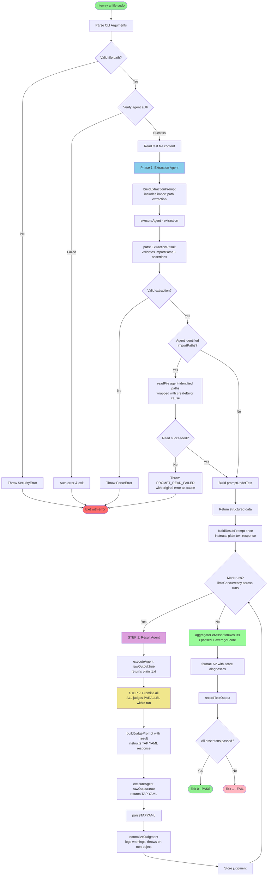

# Epic: Two-Agent Refactor + PR #394 Remediation

> **Date:** 2026-02-10
> **Status:** DRAFT -- requires user review
> **Branch:** `riteway-ai-testing-framework-implementation`
> **PR:** [#394](https://github.com/paralleldrive/riteway/pull/394)
> **Vision:** "The standard testing framework for AI Driven Development and software agents"
> **Architecture:** [two-agent-architecture.md](../plan/ai-testing-framework/two-agent-architecture.md)
> **Remediation:** [2026-02-09-pr394-remediation.md](./2026-02-09-pr394-remediation.md) (Tasks 2-7)
> **Decision:** User explicitly chose this two-agent approach over the 3-actor orchestrator (BLOCKER #1 from review -- RESOLVED)

---

## 1. Epic Summary

Convert the AI testing framework from a **single-agent self-evaluating pattern** (one agent generates output AND evaluates itself) to a **two-agent pattern** (result agent generates, judge agent evaluates), while addressing all remaining PR #394 review comments (Tasks 2-7).

**Why this matters:**
- **Result consistency** -- Same result evaluated by ALL judges in a run (no regeneration variance)
- **Separation of concerns** -- Generation is isolated from evaluation
- **Matches reviewer's requirements** -- PR comment specifies `getResult()` + `judge()` pattern
- **Score granularity** -- Judge returns `score: 0..100` for nuanced quality assessment

**Scope:**
- 11 functions survive unchanged, 7 modified, 2 removed, 4 added
- CLI layer (`bin/riteway.js`) is unaffected by core refactor
- Agent call count: +4 calls per test file (one extra result call per run)
- Result agent returns plain text (no JSON); Judge agent returns TAP YAML (not JSON)
- Agent-directed imports replace `parseImports()` regex

---

## 2. Task List

### WAVE 1 -- Independent Tasks (start immediately, all parallel)

| # | Task | Files Changed | Remediation | Blocks |
|---|------|---------------|-------------|--------|
| 1 | Test Pattern Fixes -- getAgentConfig IIFEs | `bin/riteway.js`, `bin/riteway.test.js` | Rem. Task 3 (#8, #9-#13) | -- |
| 2 | Error Testing with Try | `bin/riteway.test.js` | Rem. Task 4 (#14, #15, #16) | -- |
| 3 | Add `buildResultPrompt` (plain text response) | `source/test-extractor.js`, `source/test-extractor.test.js` | New | 7, 8 |
| 4 | Add `buildJudgePrompt` + `parseTAPYAML` (TAP YAML response) | `source/test-extractor.js`, `source/test-extractor.test.js` | New | 7, 8 |
| 5 | Add `normalizeJudgment` | `source/ai-runner.js`, `source/ai-runner.test.js` | New | 6, 8 |

### WAVE 2 -- Breaking Refactor (depends on Wave 1)

| # | Task | Files Changed | Blocked By | Blocks |
|---|------|---------------|------------|--------|
| 6 | Modify `aggregatePerAssertionResults` (`r.passed` + `averageScore`) | `source/ai-runner.js`, `source/ai-runner.test.js` | 5 | 8, 9 |
| 7 | Modify `extractTests` + agent-directed imports + remove `parseImports` + flexible assertions | `source/test-extractor.js`, `source/test-extractor.test.js` | 3, 4 | 8 |
| 8 | Modify `runAITests` (plain text result + TAP YAML judge + `Promise.all` within runs) + remove `buildEvaluationPrompt` | `source/ai-runner.js`, `source/test-extractor.js`, tests | 3, 4, 5, 6, 7 | 10, 11, 12, 13 |
| 9 | Modify `formatTAP` -- score/actual/expected diagnostics | `source/test-output.js`, `source/test-output.test.js` | 6 | 13 |

### WAVE 3 -- Post-Refactor Polish (depends on Wave 2)

| # | Task | Files Changed | Blocked By | Remediation |
|---|------|---------------|------------|-------------|
| 10 | Zod Schema Validation + Centralized Defaults | `bin/riteway.js`, `bin/riteway.test.js` | 8 | Rem. Task 2 (#1, #2, #3, #6, #7) |
| 11 | Error-Causes Switch in ai-runner.js | `source/ai-runner.js`, `source/ai-runner.test.js` | 8 | Rem. Task 5 (#4) |
| 12 | Code Style -- Eliminate Mutations | `bin/riteway.js` | 8, 10 | Rem. Task 6 (#5) |

### WAVE 4 -- Final (depends on Wave 3)

| # | Task | Files Changed | Blocked By | Remediation |
|---|------|---------------|------------|-------------|
| 13 | Failure Fixture + Documentation + Architecture Diagram | `source/fixtures/`, docs, `bin/riteway.js` | 8, 9 | Rem. Task 7 (general) |

---

## 3. Dependency Graph

```
WAVE 1 (all parallel, start immediately)
 T1 [getAgentConfig IIFEs] ────────────────────────────────────────────────────
 T2 [Error Testing w/ Try] ────────────────────────────────────────────────────
 T3 [buildResultPrompt (plain text)] ──────────┐
 T4 [buildJudgePrompt + parseTAPYAML] ─────────┤
 T5 [normalizeJudgment] ──────────────────┐    │
                                          │    │
WAVE 2 (breaking refactor)                │    │
                                          ▼    │
 T6 [aggregatePerAssertion (r.passed)] ───┐    │
                                          │    ▼
 T7 [extractTests + agent-directed        │◄───┘
     imports - remove parseImports] ──────┤
                                          │
                                          ▼
 T8 [runAITests 2-agent + Promise.all] ◄──┘    ← CRITICAL PATH BOTTLENECK
                                          │
 T9 [formatTAP] ◄──── T6                 │
                                          │
WAVE 3 (polish)                           │
                                          ▼
 T10 [Zod] ──────────────┐◄──────────────┘
 T11 [Error-Causes] ─────┤
                          │
 T12 [Mutations] ◄───T10─┘

WAVE 4 (final)
 T13 [Fixture + Docs + Diagram] ◄── T8, T9, T10, T11, T12
```

### Dependency Table

| Task | Blocked By | Blocks | Parallel With |
|------|-----------|--------|---------------|
| T1 | -- | -- | T2, T3, T4, T5 |
| T2 | -- | -- | T1, T3, T4, T5 |
| T3 | -- | T7, T8 | T1, T2, T4*, T5 |
| T4 | -- | T7, T8 | T1, T2, T3*, T5 |
| T5 | -- | T6, T8 | T1, T2, T3, T4 |
| T6 | T5 | T8, T9 | T7 |
| T7 | T3, T4 | T8 | T6 |
| T8 | T3, T4, T5, T6, T7 | T10, T11, T12, T13 | T9 (different files) |
| T9 | T6 | T13 | T7, T8 (if T6 done) |
| T10 | T8 | T12 | T11 |
| T11 | T8 | T13 | T10 |
| T12 | T8, T10 | T13 | T11 |
| T13 | T8, T9, T10, T11, T12 | -- | -- |

*T3 and T4 both add functions to `test-extractor.js` -- assign to same agent or serialize to avoid merge conflicts.

---

## 4. Parallelization Opportunities

### Maximum Parallelism: 5 agents in Wave 1

```
Agent Alpha:  T1 (getAgentConfig IIFEs)    → T10 (Zod)     → T12 (Mutations)
Agent Beta:   T2 (Error Testing)           → T11 (Error-Causes) → idle
Agent Gamma:  T3 + T4 (Result + Judge + parseTAPYAML) → T7 (extractTests + agent imports) → idle
Agent Delta:  T5 (normalizeJudgment)       → T6 (aggregate) → T9 (formatTAP)
Agent Lead:   Coordinates                  → T8 (runAITests) → T13 (Fixture + Docs)
```

### Minimum Viable Parallelism: 3 agents

```
Agent A: T1 → T2 → T10 → T12
Agent B: T3 → T4 → T5 → T6 → T7 → T9
Agent C: Coordinates → T8 → T11 → T13
```

### Serial Path (single developer)

```
T1 → T2 → T3 → T4 → T5 → T6 → T7 → T8 → T9 → T10 → T11 → T12 → T13
```

### Critical Path

```
T5 → T6 → T8 → T10 → T12 → T13
```

T8 (runAITests two-agent flow) is the critical bottleneck -- it depends on 5 prior tasks and blocks 4 downstream tasks.

---

## 5. Task Details

---

### Task 1: Test Pattern Fixes -- getAgentConfig IIFEs

**Source:** Remediation Task 3, PR comments #8, #9-#13
**Files:** `bin/riteway.js`, `bin/riteway.test.js`
**Dependencies:** None
**Parallel with:** All Wave 1 tasks

#### Requirements

1. **#8 -- Align color default test** with other test patterns: compare full object instead of just the boolean
2. **#9-#13 -- Remove IIFEs** from getAgentConfig tests per javascript.mdc ("Avoid IIFEs")
3. **Change `getAgentConfig` return value** (Option A per Q7): API should return shape consumers need (SDA principle)
   - Claude/Cursor configs: direct object comparison (no `parseOutput` function)
   - OpenCode config: test static props directly, test `parseOutput` behavior separately

#### Files Changed

- `bin/riteway.js` -- Potentially adjust getAgentConfig return value for direct assertability
- `bin/riteway.test.js` -- Rewrite IIFE tests to use block scopes / direct comparison

#### TDD Steps

1. Update tests: direct comparison for claude/cursor, block scope + separate `parseOutput` tests for opencode
2. Modify `getAgentConfig` return value if needed for direct assertability
3. Verify all tests pass

#### Acceptance Criteria

- [ ] No IIFEs in getAgentConfig tests
- [ ] Claude/cursor configs asserted via direct object comparison
- [ ] OpenCode `parseOutput` tested as separate behavior assertions
- [ ] All existing tests pass

---

### Task 2: Error Testing with Try

**Source:** Remediation Task 4, PR comments #14, #15, #16
**Files:** `bin/riteway.test.js`
**Dependencies:** None
**Parallel with:** All Wave 1 tasks

#### Requirements

1. **#14** -- Use `Try` from Riteway for sync error test (getAgentConfig with invalid agent)
2. **#15** -- Use `await Try` for async error test (runAICommand with promise rejection)
3. **#16** -- Use `await Try` for async error test (same pattern)

#### Files Changed

- `bin/riteway.test.js` -- Replace try/catch blocks with `Try` / `await Try`

#### TDD Steps

1. Import `Try` from `riteway/index.js`
2. Rewrite #14: `const error = Try(getAgentConfig, 'invalid-agent')`
3. Rewrite #15: `const error = await Try(runAICommand, { /* invalid */ })`
4. Rewrite #16: same pattern
5. Assert on `error?.cause?.name` and `error?.cause?.code`
6. Verify all tests pass

#### Acceptance Criteria

- [ ] All error tests use `Try` or `await Try`
- [ ] No try/catch blocks in test file for error testing
- [ ] Error assertions check `.cause.name` per error-causes.mdc
- [ ] All tests pass

---

### Task 3: Add `buildResultPrompt` (Plain Text Response)

**Source:** Two-agent architecture, Section 3
**Files:** `source/test-extractor.js`, `source/test-extractor.test.js`
**Dependencies:** None
**Parallel with:** T1, T2, T5 (note: serialize with T4 -- same file)

#### Requirements

Build a prompt that instructs a result agent to execute a user prompt and return only the raw output as plain text -- no evaluation, no judgment, no JSON wrapping.

**Signature:**
```js
export const buildResultPrompt = ({ userPrompt, promptUnderTest }) => string
```

**Behavior:**
- Injects `promptUnderTest` as context (**required** — `extractTests` validates before reaching here)
- Includes `userPrompt` to execute (**required** — `extractTests` validates before reaching here)
- Instructs agent to respond naturally as plain text (NOT wrapped in JSON)
- The entire stdout IS the result -- no parsing needed
- Does NOT ask agent to evaluate or judge

#### Files Changed

- `source/test-extractor.js` -- Add `buildResultPrompt` function
- `source/test-extractor.test.js` -- Add tests

#### TDD Steps

1. Write test: `buildResultPrompt({ userPrompt: 'Design X' })` includes userPrompt
2. Write test: with `promptUnderTest` -- includes context section
3. Write test: without `promptUnderTest` -- no context section
4. Write test: instructs plain text response (NOT JSON)
5. Write test: does NOT include JSON formatting instructions
6. Implement function, make tests pass

#### Acceptance Criteria

- [ ] Pure function, no side effects
- [ ] Includes userPrompt in output
- [ ] Conditionally includes promptUnderTest context
- [ ] Instructs plain text response (NOT JSON `{ "output": "..." }`)
- [ ] All tests pass

---

### Task 4: Add `buildJudgePrompt` + `parseTAPYAML` (TAP YAML Response)

**Source:** Two-agent architecture, Section 3
**Files:** `source/test-extractor.js`, `source/test-extractor.test.js`
**Dependencies:** None
**Parallel with:** T1, T2, T5 (note: serialize with T3 -- same file)

#### Requirements

**`buildJudgePrompt`** -- Build a prompt that instructs a judge agent to evaluate a specific result against a single requirement, returning TAP YAML (not JSON).

**Signature:**
```js
export const buildJudgePrompt = ({ userPrompt, promptUnderTest, result, requirement, description }) => string
```

**Behavior:**
- Presents the result agent's output (plain text) for evaluation
- States ONE requirement to evaluate against
- Requests structured judgment as TAP YAML: `{ passed, actual, expected, score }`
- Judge sees full context (promptUnderTest, userPrompt)

**Constraint:** Each judge call sees exactly ONE requirement. This prevents shared context/attention muddying between assertions.

**`parseTAPYAML`** -- Parse the judge agent's TAP YAML diagnostic output into a structured object.

**Signature:**
```js
export const parseTAPYAML = (output) => { passed, actual, expected, score }
```

**Behavior:**
- Splits on `---` markers to extract the YAML block
- Parses simple key-value YAML (no nested structures)
- Returns `{ passed: boolean, actual: string, expected: string, score: number }`
- Throws `ParseError` if no valid TAP YAML block found

**Benefits over JSON parsing:**
- No multi-strategy parsing needed (`parseStringResult` complexity eliminated for judge)
- TAP YAML is a stable, well-defined format (TAP v13 spec)
- Trivially parseable: split on `---` markers, parse simple key-value pairs

#### Files Changed

- `source/test-extractor.js` -- Add `buildJudgePrompt` and `parseTAPYAML` functions
- `source/test-extractor.test.js` -- Add tests for both

#### TDD Steps

**buildJudgePrompt:**
1. Write test: includes result in output
2. Write test: includes ONE requirement/description
3. Write test: includes full context (promptUnderTest, userPrompt)
4. Write test: instructs TAP YAML response format (`---` delimited with `passed`, `actual`, `expected`, `score`)
5. Write test: without promptUnderTest -- no context section
6. Implement function, make tests pass

**parseTAPYAML:**
7. Write test: parses valid TAP YAML block with `passed: true`
8. Write test: parses valid TAP YAML block with `passed: false`
9. Write test: handles quoted and unquoted string values
10. Write test: throws ParseError when no `---` markers found
11. Write test: parses score as number
12. Implement function, make tests pass

#### Acceptance Criteria

- [ ] `buildJudgePrompt` is pure function, no side effects
- [ ] Includes result, userPrompt, description, requirement in output
- [ ] Conditionally includes promptUnderTest context
- [ ] Instructs TAP YAML `{ passed, actual, expected, score }` response format (NOT JSON)
- [ ] Each call sees exactly ONE requirement
- [ ] `parseTAPYAML` correctly parses `---` delimited TAP YAML blocks
- [ ] `parseTAPYAML` throws `ParseError` on invalid input
- [ ] All tests pass

---

### Task 5: Add `normalizeJudgment`

**Source:** Two-agent architecture, Sections 4 and 8
**Files:** `source/ai-runner.js`, `source/ai-runner.test.js`
**Dependencies:** None
**Parallel with:** T1, T2, T3, T4

**Note:** `extractResultOutput` is no longer needed -- the result agent returns plain text and `executeAgent` with `rawOutput: true` returns the raw string directly.

#### Requirements

**`normalizeJudgment(raw, { description, runIndex, logger })`** -- Normalize judge response (parsed from TAP YAML) with safe defaults, logging, and error handling:
- **Throws** on non-object input (fail loud per error-causes.md)
- **Logs warnings** when applying defaults for missing fields (observable per javascript.md)
- `passed`: defaults to `false` if not explicitly `true`
- `actual`: defaults to `'No actual provided'`
- `expected`: defaults to `'No expected provided'`
- `score`: defaults to `0`, clamped to 0..100

#### Files Changed

- `source/ai-runner.js` -- Add `normalizeJudgment` (exported)
- `source/ai-runner.test.js` -- Add tests

#### TDD Steps

1. Write test: complete valid input -> passes through unchanged
2. Write test: missing `passed` -> defaults to `false`
3. Write test: missing `actual`/`expected` -> defaults + logs warning
4. Write test: `score` out of range -> clamped to 0..100
5. Write test: `score` not a number -> defaults to `0`
6. Write test: non-object input (null, string, undefined) -> throws `ParseError` with `JUDGE_INVALID_RESPONSE` code
7. Implement, make tests pass

#### Acceptance Criteria

- [ ] `normalizeJudgment` throws on non-object input (fail loud)
- [ ] `normalizeJudgment` logs warnings when applying defaults
- [ ] `normalizeJudgment` defaults missing fields safely
- [ ] `normalizeJudgment` clamps score to 0..100
- [ ] Uses `passed` field (not `pass`)
- [ ] All tests pass

---

### Task 6: Modify `aggregatePerAssertionResults`

**Source:** Two-agent architecture, Section 4
**Files:** `source/ai-runner.js`, `source/ai-runner.test.js`
**Blocked by:** T5 (normalizeJudgment)
**Blocks:** T8, T9

#### Requirements

- **Keep** field name `r.passed` in the filter (no breaking change -- judge response schema uses `passed`)
- Add `averageScore` calculation: average of all `r.score` values across runs
- Round `averageScore` to 2 decimal places

**New return shape per assertion:**
```js
{
  description,
  passed: passCount >= requiredPasses,
  passCount,
  totalRuns: runs,
  averageScore: Math.round(averageScore * 100) / 100,
  runResults
}
```

#### Files Changed

- `source/ai-runner.js` -- Modify `aggregatePerAssertionResults`
- `source/ai-runner.test.js` -- Update tests for `averageScore`

#### TDD Steps

1. Verify existing tests still use `r.passed` (no field name change needed)
2. Add test: `averageScore` calculated correctly from run scores
3. Add test: `averageScore` rounds to 2 decimal places
4. Add test: missing `score` values default to 0
5. Implement changes, make tests pass

#### Acceptance Criteria

- [ ] Keeps `r.passed` (not changed to `r.pass`) for counting
- [ ] Returns `averageScore` per assertion
- [ ] Score averaging handles missing/undefined scores
- [ ] Existing threshold logic unchanged
- [ ] All tests pass

---

### Task 7: Modify `extractTests` + Agent-Directed Imports + Remove `parseImports` + Flexible Assertions

**Source:** Two-agent architecture Sections 4, 8, 12
**Files:** `source/test-extractor.js`, `source/test-extractor.test.js`
**Blocked by:** T3, T4
**Blocks:** T8

#### Requirements

**Agent-directed imports (replaces `parseImports()` regex):**

Instead of the imperative `parseImports()` regex that parses import statements, the Phase 1 extraction agent DECLARATIVELY identifies imports and returns file paths that need to be resolved. Import syntax is `import 'path'` (not `import @var from 'path'` — per reviewer feedback, the binding name is unnecessary).

**New extraction result shape (from Phase 1 agent):**
```js
{
  userPrompt: string,
  importPaths: string[],  // Agent-identified file paths (replaces parseImports regex)
  assertions: [
    { id: 1, description, requirement },
    { id: 2, description, requirement },
  ]
}
```

**New `extractTests()` return shape:**
```js
{
  userPrompt: string,
  promptUnderTest: string,    // Content read from agent-identified import paths
  assertions: [
    { id: 1, description, requirement },
    { id: 2, description, requirement },
  ]
}
```

**Changes:**
- Phase 1 (extraction agent call) -- **MODIFIED**: Agent now also identifies import paths declaratively
- Phase 1.5 (import resolution) -- **MODIFIED**: Uses agent-returned `importPaths` instead of `parseImports()` regex
- Phase 2 -- Return structured data instead of mapping through `buildEvaluationPrompt`
- `parseImports()` -- **REMOVED** (agent handles import identification)
- `buildExtractionPrompt` -- **MODIFIED**: Instructs agent to also extract import file paths
- `parseExtractionResult` -- **MODIFIED**: Validates new shape (includes `importPaths`)

**Flexible assertion format:** Update `buildExtractionPrompt` to accept ANY assertion format (SudoLang, natural language, YAML, bullets) instead of only `"Given X, should Y"`.

**Import error handling:** Wrap `readFile` with `createError({cause})` instead of pre-checking with `access()`:
```js
try {
  const content = await readFile(resolvedPath, 'utf-8');
  return content;
} catch (originalError) {
  throw createError({
    name: 'ValidationError',
    message: `Failed to read imported prompt file: ${importPath}`,
    code: 'PROMPT_READ_FAILED',
    path: importPath,
    resolvedPath,
    cause: originalError  // Preserves original ENOENT or EACCES
  });
}
```

This avoids the `access()` race condition, preserves the original error, and follows error-causes.md.

#### Files Changed

- `source/test-extractor.js` -- Modify `extractTests`, `buildExtractionPrompt`, `parseExtractionResult`; remove `parseImports`
- `source/test-extractor.test.js` -- Update tests for new shape; remove `parseImports` tests

#### TDD Steps

1. Update `extractTests` tests: expect `{ userPrompt, promptUnderTest, assertions }` shape
2. Update `buildExtractionPrompt` tests: prompt now instructs agent to extract import paths
3. Update `parseExtractionResult` tests: validates `importPaths` array in response
4. Add test: missing import file -> throws `ValidationError` with code `PROMPT_READ_FAILED` and preserves original error as `cause`
5. Add test: no promptUnderTest declared -> throws `ValidationError` with code `MISSING_PROMPT_UNDER_TEST` (must NOT silently proceed without context)
6. Add test: no userPrompt defined -> throws `ValidationError` with code `MISSING_USER_PROMPT`
7. Add test: no assertions found -> throws `ValidationError` with code `NO_ASSERTIONS_FOUND`
8. Add test: flexible assertion format (update buildExtractionPrompt text)
7. Remove `parseImports` function and its tests
8. Implement changes, make tests pass

#### Acceptance Criteria

- [ ] `extractTests` returns `{ userPrompt, promptUnderTest, assertions }` (not array)
- [ ] `parseImports()` removed -- agent identifies imports declaratively
- [ ] `buildExtractionPrompt` instructs agent to extract import file paths
- [ ] `parseExtractionResult` validates new shape with `importPaths`
- [ ] `buildExtractionPrompt` accepts any assertion format
- [ ] Missing import file throws structured `ValidationError` with `cause` (not `access()` pre-check)
- [ ] Missing promptUnderTest declaration throws `ValidationError` with code `MISSING_PROMPT_UNDER_TEST` (per reviewer: must error, not silently use prompt without context)
- [ ] Missing userPrompt throws `ValidationError` with code `MISSING_USER_PROMPT` (per Eric's spec: userPrompt is always required, may be inline or imported)
- [ ] No assertions found throws `ValidationError` with code `NO_ASSERTIONS_FOUND`
- [ ] All tests pass

---

### Task 8: Modify `runAITests` + Remove `buildEvaluationPrompt`

**Source:** Two-agent architecture, Section 4
**Files:** `source/ai-runner.js`, `source/test-extractor.js`, tests for both
**Blocked by:** T3, T4, T5, T6, T7 (all Wave 1 + T6, T7)
**Blocks:** T10, T11, T12, T13

**This is the critical path bottleneck -- the core two-agent refactor.**

#### Requirements

**New flow:**
```
readFile -> extractTests -> { userPrompt, promptUnderTest, assertions }
  for each run (limitConcurrency ACROSS runs):
    1. result = executeAgent(buildResultPrompt, rawOutput: true)   // ONE call, plain text
    2. judgments = Promise.all(                                     // N calls, ALL PARALLEL
         assertions.map(a => {
           judgeOutput = executeAgent(buildJudgePrompt, rawOutput: true)  // TAP YAML
           parsed = parseTAPYAML(judgeOutput)
           return normalizeJudgment(parsed)
         })
       )
  aggregate with score averaging
```

**Key changes:**
- `extractTests` returns structured data with agent-directed imports (from Task 7)
- Build `resultPrompt` once (shared across all runs)
- Per run: call result agent ONCE (returns plain text), then judge agent per assertion (returns TAP YAML)
- Result agent output is raw string -- no `extractResultOutput` needed (entire stdout IS the result)
- Judge agent output is TAP YAML -- parsed by `parseTAPYAML()`, then normalized by `normalizeJudgment()`
- **Concurrency model:** `Promise.all` for judge calls WITHIN a run (all independent, all parallel); `limitConcurrency` ACROSS runs only
- Extract `limitConcurrency` to module scope for reuse

**Remove `buildEvaluationPrompt`:**
- Delete the function from `test-extractor.js`
- Delete its tests from `test-extractor.test.js`

#### Files Changed

- `source/ai-runner.js` -- Rewrite `runAITests` flow; add `rawOutput` flag support to `executeAgent`
- `source/test-extractor.js` -- Remove `buildEvaluationPrompt`
- `source/ai-runner.test.js` -- Update `runAITests` tests with dual mock (plain text result + TAP YAML judge)
- `source/test-extractor.test.js` -- Remove `buildEvaluationPrompt` tests

#### TDD Steps

1. Update `runAITests` tests: mock result agent returning plain text, judge agent returning TAP YAML
2. Test: result agent called ONCE per run (returns plain text, not JSON)
3. Test: judge agent called ONCE per assertion per run (returns TAP YAML)
4. Test: same plain text result passed to all judges in a run
5. Test: `parseTAPYAML` applied to judge agent output
6. Test: `normalizeJudgment` applied to parsed TAP YAML
7. Test: judge calls within a run execute via `Promise.all` (parallel)
8. Test: runs execute via `limitConcurrency` (across-run concurrency control)
9. Implement new flow, make tests pass
10. Remove `buildEvaluationPrompt` + its tests
11. Verify all tests pass

#### Acceptance Criteria

- [ ] Result agent called 1x per run, returns plain text (not JSON)
- [ ] Judge agent called 1x per assertion per run, returns TAP YAML
- [ ] Same plain text result passed to all judges in a run
- [ ] Judge calls within a run use `Promise.all` (parallel, not serialized)
- [ ] Runs use `limitConcurrency` (across-run concurrency control)
- [ ] `buildEvaluationPrompt` deleted from source and tests
- [ ] `limitConcurrency` extracted to module scope
- [ ] All tests pass

---

### Task 9: Modify `formatTAP` -- Score/Actual/Expected Diagnostics

**Source:** Two-agent architecture, Section 5 (TAP mapping)
**Files:** `source/test-output.js`, `source/test-output.test.js`
**Blocked by:** T6 (needs new field structure)
**Blocks:** T13

#### Requirements

Add score, actual, and expected to TAP diagnostic output:

```
ok 1 - Given the color scheme, should use semantic colors
  # pass rate: 3/4
  # avg score: 82.50
  # actual: Uses green for pass, red for fail, yellow for pending
  # expected: Semantic colors mapping status to intuitive colors
```

```
not ok 2 - Given the design, should be accessible to colorblind users
  # pass rate: 1/4
  # avg score: 35.00
  # actual: Uses only red/green distinction without alternative indicators
  # expected: Colorblind-safe design with patterns, shapes, or high-contrast alternatives
```

**Display choice:** Use `actual`/`expected` from the last run (all run data preserved in `runResults`).

#### Files Changed

- `source/test-output.js` -- Modify `formatTAP`
- `source/test-output.test.js` -- Add tests for new diagnostics

#### TDD Steps

1. Add test: `formatTAP` includes `# avg score:` line
2. Add test: `formatTAP` includes `# actual:` line from last run
3. Add test: `formatTAP` includes `# expected:` line from last run
4. Add test: handles missing `averageScore` gracefully
5. Implement changes, make tests pass

#### Acceptance Criteria

- [ ] TAP output includes `# avg score:` diagnostic
- [ ] TAP output includes `# actual:` and `# expected:` from last run
- [ ] Handles missing fields gracefully (no crash)
- [ ] Existing TAP format preserved (media embeds, pass rate)
- [ ] All tests pass

---

### Task 10: Zod Schema Validation + Centralized Defaults

**Source:** Remediation Task 2, PR comments #1, #2, #3, #6, #7
**Files:** `bin/riteway.js`, `bin/riteway.test.js`
**Blocked by:** T8
**Blocks:** T12

#### Requirements

1. **Centralized defaults:**
   ```js
   const defaults = { runs: 4, threshold: 75, concurrency: 4, agent: 'claude', color: false };
   ```
2. **Replace magic numbers** with `defaults.*`
3. **Add Zod schema validation** for `parseAIArgs`
4. **Connect Zod errors to error-causes** pattern
5. **`parseAIArgs([])` should throw** ValidationError (currently returns incomplete object)
6. **Simplify color flags:** Drop `--no-color`, keep only `--color` (default: false)

#### Files Changed

- `bin/riteway.js` -- Add Zod schema, centralize defaults, simplify color
- `bin/riteway.test.js` -- Update tests for validation errors, remove `--no-color` tests

#### TDD Steps

1. Write test: `parseAIArgs([])` -> ValidationError
2. Write test: `parseAIArgs(['file.sudo'])` -> valid args with defaults
3. Write test: invalid threshold -> ValidationError
4. Install Zod: `npm install zod`
5. Implement schema, make tests pass
6. Remove `--no-color` flag and update tests

#### Acceptance Criteria

- [ ] Zod validates all parseAIArgs inputs
- [ ] Missing filePath throws ValidationError
- [ ] Invalid threshold/runs/concurrency throw ValidationError
- [ ] All magic numbers replaced with `defaults.*`
- [ ] `--no-color` flag removed; `--color` enables color, absence means no color
- [ ] Zod errors connected to error-causes pattern
- [ ] All tests pass

---

### Task 11: Error-Causes Switch in ai-runner.js

**Source:** Remediation Task 5, PR comment #4
**Files:** `source/ai-runner.js`, `source/ai-runner.test.js`
**Blocked by:** T8
**Parallel with:** T10

#### Requirements

Define module-level `errorCauses` in `ai-runner.js`:

```js
const [aiErrors, handleAIErrors] = errorCauses({
  SecurityError: { code: 'SECURITY_VIOLATION', message: 'Security violation detected' },
  ParseError: { code: 'PARSE_FAILURE', message: 'Failed to parse AI response' },
  ValidationError: { code: 'VALIDATION_FAILURE', message: 'Invalid input parameters' },
  TimeoutError: { code: 'AGENT_TIMEOUT', message: 'AI agent timed out' },
  AgentProcessError: { code: 'AGENT_PROCESS_FAILURE', message: 'AI agent process failed' },
});
```

Replace all ad-hoc `createError` and `new Error()` calls with defined error causes.

#### Files Changed

- `source/ai-runner.js` -- Add errorCauses, refactor error throws
- `source/ai-runner.test.js` -- Verify error cause names and codes

#### TDD Steps

1. Write tests verifying error cause names and codes
2. Add errorCauses definition at module level
3. Refactor all createError/new Error calls to use defined causes
4. Export `handleAIErrors` for consumer use
5. Verify all tests pass

#### Acceptance Criteria

- [ ] Module-level `errorCauses` definition with all error types
- [ ] All `new Error()` calls replaced with `createError({ ...errorType })`
- [ ] `handleAIErrors` exported for use in bin/riteway.js
- [ ] Error tests verify `.cause.name` and `.cause.code`
- [ ] All tests pass

---

### Task 12: Code Style -- Eliminate Mutations

**Source:** Remediation Task 6, PR comment #5
**Files:** `bin/riteway.js`
**Blocked by:** T8, T10
**Parallel with:** T11

#### Requirements

Per javascript.mdc -- eliminate mutations in `runAICommand`:

1. **`let outputPath` -> `.catch()` pattern:**
   ```js
   const outputPath = await recordTestOutput(...).catch(e => {
     throw createError({ ...OutputError, cause: e });
   });
   ```

2. **`assertions.forEach` -> `map/join`:**
   ```js
   const output = assertions.map(formatAssertion).join('');
   ```

3. **Extract `formatAssertionReport`** -- separate IO from logic

#### Files Changed

- `bin/riteway.js` -- Refactor mutations in `runAICommand`

#### TDD Steps

1. Ensure existing tests cover current behavior
2. Refactor `let outputPath` to `const` with `.catch()`
3. Refactor `forEach` to `map/join`
4. Extract `formatAssertionReport` helper
5. Verify all tests pass after each change

#### Acceptance Criteria

- [ ] No `let` in `runAICommand`
- [ ] No `forEach` with side effects
- [ ] `formatAssertionReport` extracted as pure function
- [ ] All tests pass

---

### Task 13: Failure Fixture + Documentation + Architecture Diagram

**Source:** Remediation Task 7, general review comment, additional requirements
**Files:** `source/fixtures/`, docs, test files
**Blocked by:** T8, T9, T10, T11, T12

#### Requirements

1. **Failure fixture:** Create `source/fixtures/wrong-prompt-test.sudo` with deliberately wrong Prompt Under Test (e.g., "Make everything brown") that should fail assertions
2. **Test for failure fixture:** Run fixture and assert that results report failures
3. **Update help text** in `bin/riteway.js` if CLI interface changed
4. **Update README** AI testing section if user-facing API changed
5. **Architecture diagram:** Create Mermaid flowchart for two-agent architecture

#### Architecture Diagram

Create in `plan/ai-testing-framework/two-agent-flowchart.md`:



#### TDD Steps

1. Create `source/fixtures/wrong-prompt-test.sudo` with bad prompt
2. Write test that runs fixture and asserts failure results
3. Update all fixture files to use `import 'path'` syntax (not `import @var from 'path'`)
4. Update help text if needed
5. Update README AI testing section if needed
6. Create architecture diagram
7. Note: consider documenting `import 'path' as varName` as a future enhancement for named imports

#### Acceptance Criteria

- [ ] Failure fixture exists and is runnable
- [ ] Test confirms framework correctly reports failures from wrong prompt
- [ ] All fixture files use `import 'path'` syntax (per reviewer feedback)
- [ ] Help text matches current CLI interface
- [ ] README reflects current API/format
- [ ] Mermaid architecture diagram created for two-agent flow
- [ ] All tests pass

---

## 6. Architecture Diagram (Two-Agent Flow)

### Current Flow (Single Agent -- 16 calls for 4 assertions x 4 runs)

```
CLI
 |
 +-- readTestFile(path)
 |
 +-- extractTests(content)
 |    +-- Phase 1: buildExtractionPrompt --agent--> [{ id, desc, userPrompt, req }]
 |    +-- Phase 1.5: parseImports + readFile -----> promptUnderTest
 |    +-- Phase 2: buildEvaluationPrompt ---------> [{ prompt, description }]
 |
 +-- For each (assertion x run):                    4 x 4 = 16 calls
 |    +-- executeAgent(evaluationPrompt) --agent--> { passed, output }
 |
 +-- aggregatePerAssertionResults
 |
 +-- formatTAP + recordTestOutput
```

### New Flow (Two Agents + Agent-Directed Imports + TAP YAML)

```
CLI
 |
 +-- readTestFile(path)
 |
 +-- extractTests(content)                          PHASE 1: AGENT-DIRECTED IMPORTS
 |    +-- Phase 1: buildExtractionPrompt --agent--> { userPrompt, importPaths, assertions }
 |    |           (agent identifies imports          <-- parseImports() REMOVED
 |    |            declaratively)
 |    +-- Phase 1.5: readFile(importPaths) -------> promptUnderTest
 |    |           (CLI reads agent-identified         (wrapped with createError({cause}))
 |    |            files)
 |    +-- Phase 2: Return structured data --------> { userPrompt, promptUnderTest, assertions }
 |
 +-- buildResultPrompt(userPrompt, promptUnderTest)
 |
 +-- For each run (4 runs) -- limitConcurrency ACROSS runs:
 |    |
 |    +-- STEP 1: executeAgent(resultPrompt) -----> plain text (raw response) <-- 1 call
 |    |           Result Agent: GENERATE ONLY        (no JSON, no parsing)
 |    |
 |    +-- STEP 2: Promise.all -- ALL judges PARALLEL within run:
 |         |
 |         +-- executeAgent(judgePrompt) ----------> TAP YAML:                <-- 4 calls
 |              Judge Agent: EVALUATE ONLY           ---
 |              parseTAPYAML() -> normalize           passed: true
 |                                                   actual: "..."
 |                                                   expected: "..."
 |                                                   score: 85
 |                                                   ---
 |
 |    Total per run: 1 + 4 = 5 calls
 |    Total: 4 runs x 5 = 20 calls + 1 extraction = 21 calls
 |
 +-- aggregatePerAssertionResults (with averageScore, r.passed unchanged)
 |
 +-- formatTAP (with score/actual/expected diagnostics)
 |
 +-- recordTestOutput
```

### Agent Call Count Formula

```
Total = 1 extraction + runs x (1 result + N judge)
     = 1 + runs x (1 + N)

Default (4 assertions, 4 runs):  1 + 4(1+4) = 21
Current single-agent:            1 + 4x4    = 17
Delta:                           +4 calls (+24%)
```

### Sequence Diagram (Single Run)

```
               CLI           Extraction        Result          Judge
                |             Agent             Agent           Agent(s)
                |               |                 |               |
 readTestFile ->|               |                 |               |
                |               |                 |               |
 extractTests ->|--prompt------>|                 |               |
                |<-{ userPrompt,|                 |               |
                |  importPaths, |                 |               |
                |  assertions } |                 |               |
                |               |                 |               |
 readFile      |               |                 |               |
 (imports)     |               |                 |               |
                |               |                 |               |
 buildResult   |               |                 |               |
 Prompt        |--resultPrompt----------------->|               |
                |<--plain text: "color scheme..."  |               |
                |               (raw response)    |               |
                |                                 |               |
 Promise.all ->|  (all judges in parallel)       |               |
                |                                 |               |
 assertion 1:  |--judgePrompt(+result)------------------------->|
 assertion 2:  |--judgePrompt(+same result)-------------------->|
 assertion 3:  |--judgePrompt(+same result)-------------------->|
 assertion 4:  |--judgePrompt(+same result)-------------------->|
                |                                 |               |
                |<--TAP YAML: ---                                |
                |   passed: true, actual, expected, score        |
                |   ---                                          |
                |<--(all 4 judge responses arrive in parallel)   |
                |                                 |               |
 parseTAPYAML ->|                                 |               |
 normalize ---->|                                 |               |
 aggregate ---->|                                 |               |
 formatTAP ---->|                                 |               |
```

---

## 7. Risk Assessment

### High Risk

| Risk | Impact | Mitigation |
|------|--------|------------|
| T8 (runAITests) is complex with many deps | Blocks all downstream work | Start Wave 1 early; T8 should be assigned to most experienced agent |
| Result agent returns garbage output | Judge gets garbage input | Result is plain text -- any string is valid. If garbage, judge correctly fails assertions |
| Judge returns malformed TAP YAML | Aggregation breaks | `parseTAPYAML` throws on invalid format; `normalizeJudgment` logs warnings + throws on non-object (fail loud) |
| Merge conflicts from parallel file edits | Lost work | T3+T4 same agent (both touch test-extractor.js); T6+T8 same agent (both touch ai-runner.js) |

### Medium Risk

| Risk | Impact | Mitigation |
|------|--------|------------|
| +24% more agent calls per test file | Higher cost, slower execution | Trade-off is explicit; result consistency + separation of concerns worth it |
| Zod dependency adds bundle size | Package bloat | Zod is well-maintained, tree-shakeable; reviewer requested it (#3) |
| Agent-directed imports less reliable than regex | Import paths may be incorrect | Agent sees full test file context; LLMs handle pattern recognition well; `readFile` errors are descriptive with `cause` |
| Flexible assertion format may confuse extraction agent | Inconsistent extraction results | Extraction prompt instructs LLM to handle any format; LLMs are good at this |

### Low Risk

| Risk | Impact | Mitigation |
|------|--------|------------|
| `--no-color` removal breaks existing scripts | User inconvenience | `--color` was always opt-in; `--no-color` was redundant |
| Error-causes refactor changes error shapes | Test updates needed | Tests already check `.cause.name`; shape changes are internal |

---

## 8. What Survives vs What Changes

| Component | File | Status | Notes |
|-----------|------|--------|-------|
| `validateFilePath` | ai-runner.js | **Survives** | Security validation for CLI paths |
| `parseStringResult` | ai-runner.js | **Survives** | Only used by extraction agent call (Phase 1); result and judge agents use `rawOutput: true`. May become dead code if extraction moves away from JSON. |
| `parseOpenCodeNDJSON` | ai-runner.js | **Survives** | OpenCode wire protocol (NOT AI content parsing) |
| `readTestFile` | ai-runner.js | **Survives** | File reading utility |
| `calculateRequiredPasses` | ai-runner.js | **Survives** | Threshold math |
| `executeAgent` | ai-runner.js | **Modified** | Added `rawOutput` flag for plain text result + TAP YAML judge output |
| `verifyAgentAuthentication` | ai-runner.js | **Survives** | Auth smoke test |
| `createDebugLogger` | debug-logger.js | **Survives** | Debug infrastructure |
| `parseImports` | test-extractor.js | **Removed** | Replaced by agent-directed imports (extraction agent identifies import paths declaratively) |
| `buildExtractionPrompt` | test-extractor.js | **Modified** | Flexible assertion format + instructs agent to extract import paths |
| `parseExtractionResult` | test-extractor.js | **Modified** | Validates new shape (includes `importPaths`) |
| `extractJSONFromMarkdown` | test-extractor.js | **Survives** | Used by `parseExtractionResult` |
| `tryParseJSON` | test-extractor.js | **Survives** | Used by `parseExtractionResult` |
| `formatTAP` | test-output.js | **Modified** | Add score/actual/expected diagnostics |
| `recordTestOutput` | test-output.js | **Survives** | File output |
| `getAgentConfig` | bin/riteway.js | **Modified** | Return value change for testability |
| `parseAIArgs` | bin/riteway.js | **Modified** | Zod validation + centralized defaults |
| `runAICommand` | bin/riteway.js | **Modified** | Eliminate mutations |
| `aggregatePerAssertionResults` | ai-runner.js | **Modified** | Keeps `r.passed` field + adds `averageScore` |
| `runAITests` | ai-runner.js | **Modified** | Two-agent flow; `Promise.all` within runs, `limitConcurrency` across runs |
| `extractTests` | test-extractor.js | **Modified** | Agent-directed imports + new return shape |
| `buildEvaluationPrompt` | test-extractor.js | **Removed** | Replaced by `buildResultPrompt` + `buildJudgePrompt` |
| `buildResultPrompt` | test-extractor.js | **New** | Result agent prompt (plain text response) |
| `buildJudgePrompt` | test-extractor.js | **New** | Judge agent prompt (TAP YAML response) |
| `parseTAPYAML` | test-extractor.js | **New** | Parses judge's TAP YAML output (--- delimited) |
| `normalizeJudgment` | ai-runner.js | **New** | Normalize judge response; logs warnings, throws on non-object |

**Summary:** 11 survive unchanged, 9 modified, 2 removed, 4 added = 26 total functions

---

## References

- [vision.md](../vision.md) -- "The standard testing framework for AI Driven Development and software agents"
- [Two-agent architecture](../plan/ai-testing-framework/two-agent-architecture.md) -- Design document
- [PR #394 remediation](./2026-02-09-pr394-remediation.md) -- Tasks 2-7
- [Requirements conflict analysis](../plan/ai-testing-framework/requirements-conflict-analysis.md) -- Epic vs implementation gaps
- [Original epic](./archive/2026-01-22-riteway-ai-testing-framework/2026-01-22-riteway-ai-testing-framework.md) -- Original task breakdown
- [Existing flowchart](../plan/ai-testing-framework/archive/flowchart.md) -- Previous architecture diagram (archived)
- [PR #394](https://github.com/paralleldrive/riteway/pull/394) -- Pull request under review
- [janhesters review](https://github.com/paralleldrive/riteway/pull/394#pullrequestreview-3764740159) -- Review being remediated
